# Создание своей эргономичной клавиатуры (v1)

## Часть 1: создание раскладки

Опубликована на [Habr][ch1-habr], [Medium][ch1-medium] и [LinkedIn][ch1-lin].

[ch1-medium]: https://medium.com/@datacompboy/building-my-own-ergo-keyboard-chapter-1-91365cb5df0c?source=friends_link&sk=8509f62b3ab02e2b620bd3738f30f957
[ch1-lin]: https://www.linkedin.com/pulse/building-my-own-ergo-keyboard-ch1-anton-fedorov/
[ch1-habr]: https://habr.com/ru/post/669698/

### Зачем

Всякий, кто работает за компьютером, каждый рабочий день касается клавиатуры. (И мыши, разумеется).
Мы меняемся -- и предпочтения как и на что нажимать тоже меняются со временем.

Я самоучка, учился набирать когда тренажеров клавиатуры не было -- или они были ужасно скучными.
В итоге я выработал свою собственную технику набора, которая включает в себя даже несколько
"запеченных" ошибок -- когда я точно знаю что левый палец сейчас нажмет неправильную кнопку, поэтому
палец правой руки уже на бэкспейсе. Но это не цель, и часть опечаток просто опечатки.

Долгое время моей любимой клавиатурой была [A4Tech KB(S)-8] (и [A4Tech KB(S)-720]) потому, что как только
я пересел на неё, количество опечаток значительно снизилось без каких-либо усилий с моей стороны, она
просто оказалась лучше заточена под меня.

Я не особо беспокоился ни о туннельном синдроме ни об эргономике клавиатуры помимо того, чтобы было удобно
печатать. Но когда начались локдауны в связи с короной, мне пришлось оборудовать домашнее рабочее место,
а запасы клавиатур были очень ограничены. Помимо всего прочего, их больше не выпускают (ну, я нашел что
они еще есть под другим брендом, но всё же). Так пришла пора поискать что-нибудь новое, желательно более
удобное.

После некоторого гуглежа чего-нибудь "обычное, но разломанное", была заказана "Kensington Pro Fit Ergo"
за то, что она полноразмер (включая стрелки и нумпад), низкопрофильные кнопки (к которым я уже достаточно
привык чтобы считать это плюсом) и с отрицательным наклоном, как советовали в гайдах.

Привыкание к разломанной потребовало времени -- и я всё еще не полностью адаптировался... -- в основном
из-за моего навыка печати. Как я уже писал, я самоучка, и средние столбцы общие для обеих рук. Я могу
нажать "y" как левой так и правой рукой, то же с другими средними кнопками -- в итоге я часто жал
вместо "y" -- "t" или "n" вместо "b". Так же неприятно ткнуть в пустое место клавиатуры вместо нажатия
на "7". Заметив эту проблему, я попытался найти клавиатуру у которых средние столбцы продублированы, но
таких клавиатур на рынке просто нет. И если смотреть на менее обычные, типа ErgoDox, то даже там как-то
оно не предусмотрено (да еще и ортолинейные, что мне не понравилось когда я пробовал). Я даже постучался
к некоторым производителям эрго клавиатур -- но никто не заинтересовался.

Хорошо, что еще можно сделать? Я погуглил еще на тему DIY наборов -- ничего, что бы понравилось, не нашел.

Что еще мне не понравилось в этой клаве? Цифровой блок. Нынче мышь часть моей работы слишком часто и
цифровой блок постоянно мешается. К тому же, я им не пользуюсь. Продолжение поисков привело меня к
Microsoft Sculpt, у которой нумпад отдельный, а блок стрелок вжат в правую половину, как часто делают
на ноутах -- причем home/end/pgup/pgup/pgdn отдельными кнопками по правому краю, а не через комбинацию
с Fn. Чудесно! Заказал.

Это был шаг в перед в комфорте, но всё еще не идеально: мне больше по нраву Home/PgUp/PgDn/End а не
Home/End/PgUp/PgDn. Кнопки управления музыкой спрятаны за физическим переключателем, не комбинацией c Fn,
что делает их бесполезными (я пользуюсь Fx кнопками постоянно, поэтому выключить их и забыть не подходит).
Большая кнопка "Delete" тоже спорное решение, положение Ins в итоге получается не оч. А еще я заметил
через некоторое время, что я клавиатуру постоянно двигаю то левее то правее -- и неудобно ни так ни так --
расстояние между половинами надо бы побольше...

В принципе, я бы так и остался жить на Sculpt -- в конце концов, количество неудобств сильно меньше чем
было, но один из новых коллег предложил команде класс сбора клавиатур в качестве дня развлечения, так что
я пошел изучать что же есть доступного для создания своей клавиатуры. Как только я узнал про сайты
www.keyboard-layout-editor.com и builder.swillkb.com я понял, что создание клавиатуры своей мечты гораздо
проще чем я думал.

А если можно -- почему бы и не попробовать? Будет весело!

Я опишу весь процесс создания так подробно как смогу, чтобы читатель смог действовать по аналогии
и построить себе кастомную клавиатуру созданную идеально под себя -- так же как я сделал себе свою.

[A4Tech KB(S)-8]: https://www.ixbt.com/peripheral/a4tech-kbs-8.shtml
[A4Tech KB(S)-720]: https://www.dns-shop.ru/product/b27f9f0908876f9f/klaviatura-a4tech-kbs-720/

### Список требований

Итак, список требований к клавиатуре-язю, клавиатуре моей мечты:

  * Отдельные левая и правая половины.
  
	Практически невозможно подобрать одну единственную дистанцию которая бы была удобна всегда. К тому
	же, во время игры правая половина просто не нужна, а вот дополнительное пространство для мыши очень
	даже надо.
  * Без цифрового блока.

	Я им не пользуюсь, а если уж внезапно он понадобится чтоб вбить много чисел -- у меня еще есть N
	штук от Sculpt клавиатур. Да и он тривиально делается.
  * Полноразмерные стрелки, интегрированные в правую половину плюс Home/PgUp/PgDn/End столбец над ними.
  
	За годы пользования ноутбуков я понял что эта раскладка очень компактна, при этом расстояние между
	стрелками и мышью достаточно небольшое чтобы было не очень тяжело работать.
  * Два центральных столбца кнопок дублированы (раскладка "qwerty / tyuiop").
  
	Раскладка, которая мне нужна, но которую никто не делает. Да, дублирование кнопок в центре это лишние
	затраты. Но, как я написал во вступлении, моя техника печати предполагается досягаемость этих
	кнопок обеими руками, а цена лишних 10 кнопок на небольшом количестве клавиатур незначительна.
  * Низкопрофильные клавиши с коротким ходом.

	То есть тонкие, мягие, тихие. Я не фанат звука печатной машинки, да и клацанье слабо слышно через
	музыку в наушниках всё равно.
  * Воспроизводимость.
  
	Ага, мне нужна не одна клавиатура -- нужна запасная на случай залива Швепсом! Да и офис не только
	в домашнем офисе но и в офисном офисе. И там тоже нужны бэкапы.
  * Настраиваемый наклон и углы влево-вправо, к себе-от себя.
  
	Плоская клавиатура вполне себе норм, но после печати некоторое время на Sculpt, плюсы от наличия
	приподнятого центра явно заметны. А отрицательный наклон от себя при печати на ходу на дорожке
	и правда необходим.

Список явно не полон, так что буду дописывать в процессе использования потом, но начать уже есть с чего.

А если у читателя есть желание скрафтить себе свою клавиатуру -- то начать надо именно с составления
аналогичного списка. Подумать что действительно важно? Какие вещи постоянно мешаются в повседневной
работе и хотелось бы изменить? Какие вещи настолько комфортны что их просто уже не замечаешь? Записать
это всё. И возвращаться к списку каждый раз когда надо будет делать выбор.

### Создание раскладки

Поскольку готовых клавиатур или китов под qwerty/tyuiop раскладку нет, создание её было было сутью
всего начинания.

Итак, раскладываем базовый пасьянс. В [KLE] легко и просто начинать с базовых раскладок, так что я
взял 104 кнопочную как базу, удалил лишние клавиши, относящиеся к правой половине, подвигал так, чтоб
выглядело хорошо, повторли процесс для второй половины. А потом потюнил еще. И еще.

Один из промежуточных дизайнов выглядел вот так: 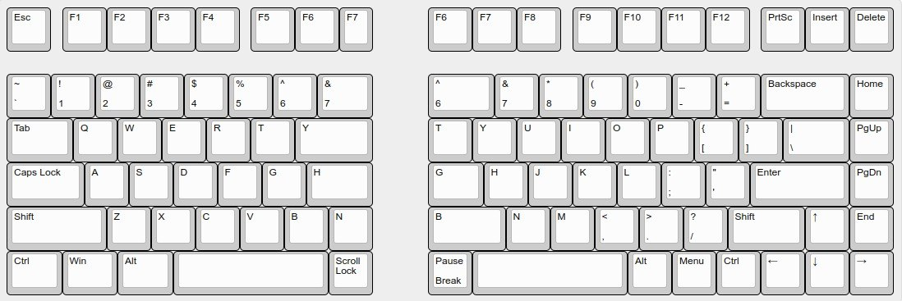

Я продолжал обдумывать и двигать немного пока не появилось ощущения что "вот, оно": добавил кнопку Fn,
близко к тому как сделано в Kingston или ноутбуках и убрал ненужные вещи которые пытался сперва
воткнуть возле пробелов (не помню, когда последний раз потребовались Scroll Lock и Pause/Break). 
А если вдруг понадобится -- их можно будет нажать через Fn+Caps или Fn+PrintScreen.

Что ж, пришла пора слегка изогнуть раскладку. Зачем? Ну, пальцы у человека разной длины -- оказалось
уж очень удобно печатать на слегка изогнутой. Однако же, изгибание раскладки в [KLE] не самая простая
задача. Я потратил немало времени на попытки разворачивать кнопки относительно разных базовых точек --
поворот относительно угла раскладки, поворот относительно единой точки ниже клавиатуры, поворот вокруг
угла или центра каждой из кнопок... В итоге остановился на самом простом: средний столбец остается
горизонтальным, столбцы левее повернуты на небольшой отрицательный угол, столбцы правее на небольшой
положительный и поворот сделан относительно угла раскладки. Еще следует помнить, что размеры кнопок
начинаются с 1u, и найти готовые можно только довольно "стандартные" размеры клавиш (с шагом 0.25 и
то не все).

В процессе я использовал builder.swillkb.com для генерации расположения свичей и печатал на A4 бумаге,
чтобы примерить к руке. Из-за лени я не пытался накладывать их на картон или клеить картонные бляшки
сверху, однако же это рекомендуется :)

В конце концов, я пришел к вот такой раскладке для [левой половины][left]:
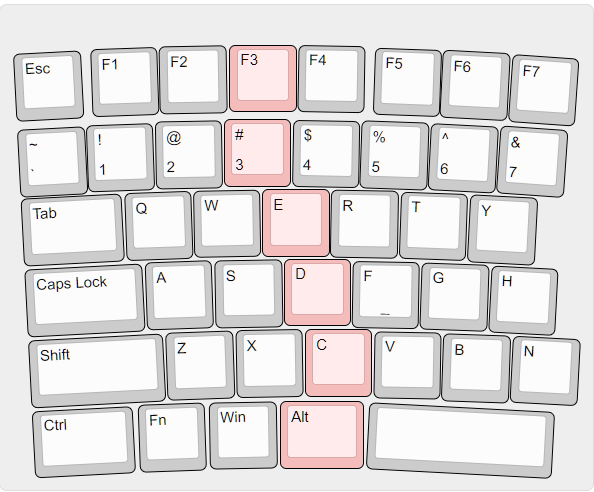

И вот такой [правой][right]:
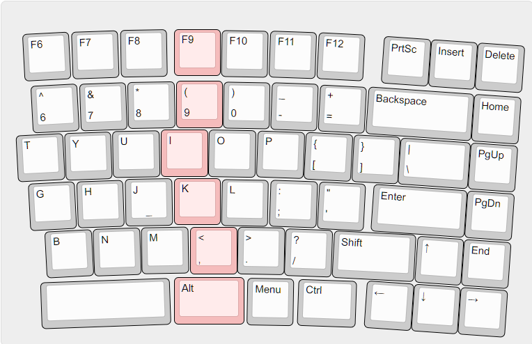

Разумеется, к следующей версии дизайна я еще подумаю как и что поменять (например, еще поиграть с
опорной точки вращения, сделать более "гладким" край, сдвинуть ряды друг относительно друга и пр),
но в какой-то момент лучше сказать стоп и сделать что-то, чем продолжать пялиться в экран. К тому же
у меня нет ничего для быстрого прототипирования дома так же как нет и доступа в кружок юного техника,
чтобы попробовать разные варианты "вживую", короче дизайн достаточно хорош для первой версии.

Как только раскладка определена, стоит сохранить ссылки на раскладку в KLE, сохранить содержимое
вкладки "Raw data" и скачать JSON файл (доступно через меню в правом-верхнем углу). Все они еще
понадобятся далее, и достать подготовленную копию лучше чем бегать в KLE каждый раз.

[KLE]: https://www.keyboard-layout-editor.com
[left]: http://www.keyboard-layout-editor.com/##@_switchMount=cherry&switchBrand=kailh&pcb:false&plate:true%3B&@_y:0.42&x:3.23&c=%23f5bcbc%3B&=F3%3B&@_y:0.10000000000000009&x:3.15%3B&=%23%0A3%3B&@_y:0.040000000000000036&x:3.72%3B&=E%3B&@_y:0.029999999999999805&x:4.04%3B&=D%3B&@_y:0.040000000000000036&x:4.35&sb=kailh%3B&=C%3B&@_y:0.07000000000000028&x:3.98&w:1.25%3B&=Alt%3B&@_r:1&y:-6.36&x:4.26&c=%23cccccc%3B&=F4%3B&@_y:0.1100000000000001&x:4.2%3B&=$%0A4%3B&@_y:0.029999999999999805&x:4.79%3B&=R%3B&@_y:0.040000000000000036&x:5.12%3B&=F%0A%0A%0A%0A%0A%0A%0A%0A%0A%0A%2F_%3B&@_y:0.040000000000000036&x:5.46%3B&=V%3B&@_r:2&y:-5.3&x:5.4%3B&=F5%3B&@_y:0.0900000000000003&x:5.25%3B&=%25%0A5%3B&@_y:0.029999999999999805&x:5.86%3B&=T%3B&@_y:0.040000000000000036&x:6.21%3B&=G%3B&@_y:0.040000000000000036&x:6.57%3B&=B%3B&@_r:3&y:-5.31&x:6.42%3B&=F6%3B&@_y:0.08999999999999964&x:6.3%3B&=%5E%0A6%3B&@_y:0.029999999999999805&x:6.94%3B&=Y%3B&@_y:0.029999999999999805&x:7.3%3B&=H%3B&@_y:0.020000000000000462&x:7.68%3B&=N%3B&@_y:0.09999999999999964&x:5.6&a:7&w:2.75%3B&=%3B&@_r:4&y:-6.39&x:7.45&a:4%3B&=F7%3B&@_y:0.06999999999999984&x:7.35%3B&=%2F&%0A7%3B&@_r:-3&y:-1.5500000000000003%3B&=Esc%3B&@_y:0.13000000000000012%3B&=~%0A%60%3B&@_y:0.020000000000000462&w:1.5%3B&=Tab%3B&@_y:0.04999999999999982&w:1.75%3B&=Caps%20Lock%3B&@_y:0.04999999999999982&w:2%3B&=Shift%3B&@_y:0.04999999999999982&w:1.5%3B&=Ctrl%3B&@_r:-2&y:-6.33&x:1.15%3B&=F1%3B&@_y:0.12000000000000033&x:1.05%3B&=!%0A1%3B&@_y:0.03000000000000025&x:1.58%3B&=Q%3B&@_y:0.040000000000000036&x:1.85%3B&=A%3B&@_y:0.04999999999999982&x:2.12%3B&=Z%3B&@_y:0.04999999999999982&x:1.67%3B&=Fn%3B&@_r:-1&y:-6.33&x:2.18%3B&=F2%3B&@_y:0.11000000000000054&x:2.1%3B&=%2F@%0A2%3B&@_y:0.03000000000000025&x:2.65%3B&=W%3B&@_y:0.040000000000000036&x:2.95%3B&=S%3B&@_y:0.040000000000000036&x:3.24%3B&=X%3B&@_y:0.05999999999999961&x:2.83%3B&=Win
[left-alt]: https://tinyurl.com/2p8awefu
[right]: http://www.keyboard-layout-editor.com/##@_switchMount=cherry&switchBrand=kailh&pcb:false&plate:true%3B&@_y:0.42&x:3.5&c=%23f5bcbc%3B&=F9%3B&@_y:0.10000000000000009&x:3.55%3B&=(%0A9%3B&@_y:0.040000000000000036&x:3.23%3B&=I%3B&@_y:0.029999999999999805&x:3.5%3B&=K%3B&@_y:0.040000000000000036&x:3.85&sb=kailh%3B&=<%0A,%3B&@_y:0.07000000000000028&x:3.5&w:1.5%3B&=Alt%3B&@_r:1&y:-6.3500000000000005&x:4.53&c=%23cccccc%3B&=F10%3B&@_y:0.10000000000000031&x:4.59%3B&=)%0A0%3B&@_y:0.029999999999999805&x:4.3%3B&=O%3B&@_y:0.040000000000000036&x:4.59%3B&=L%3B&@_y:0.020000000000000462&x:4.95%3B&=>%0A.%3B&@_y:0.08000000000000007&x:5.17%3B&=Menu%3B&@_r:2&y:-6.37&x:5.57%3B&=F11%3B&@_y:0.10000000000000009&x:5.64%3B&=%2F_%0A-%3B&@_y:0.029999999999999805&x:5.38%3B&=P%3B&@_y:0.040000000000000036&x:5.69%3B&=%2F:%0A%2F%3B%3B&@_y:0.03000000000000025&x:6.05%3B&=%3F%0A%2F%2F%3B&@_y:0.05999999999999961&x:6.35&w:1.25%3B&=Ctrl%3B&@_r:3&y:-6.38&x:6.6%3B&=F12%3B&@_y:0.1100000000000001&x:6.69%3B&=+%0A%2F=%3B&@_y:0.029999999999999805&x:6.45%3B&=%7B%0A%5B&_x:0.009999999999999787%3B&=%7D%0A%5D%3B&@_y:0.040000000000000036&x:6.78%3B&="%0A'%3B&@_y:0.019999999999999574&x:7.15&w:1.75%3B&=Shift%3B&@_r:4&y:-5.33&x:8%3B&=PrtSc&=Insert&=Delete%3B&@_y:0.10000000000000009&x:7.75&w:2.25%3B&=Backspace&=Home%3B&@_y:0.029999999999999805&x:8.5&w:1.5%3B&=%7C%0A%5C&=PgUp%3B&@_y:0.03000000000000025&x:8&w:2%3B&=Enter&=PgDn%3B&@_y:0.03000000000000025&x:9%3B&=↑&=End%3B&@_y:0.02999999999999936&x:8%3B&=←&=↓&=→%3B&@_r:-3&y:-5.68&x:0.25%3B&=F6%3B&@_y:0.10999999999999988&x:0.37%3B&=%5E%0A6%3B&@_y:0.03000000000000025%3B&=T%3B&@_y:0.040000000000000036&x:0.2%3B&=G%3B&@_y:0.02999999999999936&x:0.51%3B&=B%3B&@_r:-2&y:-5.23&x:1.3%3B&=F7%3B&@_y:0.11000000000000032&x:1.43%3B&=%2F&%0A7%3B&@_y:0.040000000000000036&x:1.08%3B&=Y%3B&@_y:0.03000000000000025&x:1.3%3B&=H%3B&@_y:0.03000000000000025&x:1.62%3B&=N%3B&@_y:0.08999999999999986&x:0.46&a:7&w:2.75%3B&=%3B&@_r:-1&y:-6.34&x:2.35&a:4%3B&=F8%3B&@_y:0.09999999999999964&x:2.49%3B&=*%0A8%3B&@_y:0.040000000000000036&x:2.15%3B&=U%3B&@_y:0.029999999999999805&x:2.4%3B&=J%0A%0A%0A%0A%0A%0A%0A%0A%0A%0A%2F_%3B&@_y:0.02999999999999936&x:2.73%3B&=M
[right-alt]: https://tinyurl.com/3chhv2ky

<!-- --------- Конец 1й части "

### Продолжение следует

[В следующей части] я рассказываю о доступной элементной базе, имеющихся вариаций свичей и вариантов
производства где придётся искать первые компромиссы в поисках идеального баланса.

В части 3 клавиатура будет собрана в прошита.

Четвертая часть выделена под рассмотрение корпусирования клавиатуры.

И, наконец, в пятой главе рассмотрим дизайн и производство крышек.

--------- Часть 2 -->

## Часть 2: выбор деталей, дизайн и заказ основы

Опубликована на [Habr][ch2-habr], [Medium][ch2-medium] и [LinkedIn][ch2-lin].

[ch2-medium]: https://medium.com/@datacompboy/building-my-own-ergo-keyboard-ch-2-hardware-tradeoffs-271bec3cee2b?source=friends_link&sk=13e6792acb93e835919551b867b044a6
[ch2-lin]: https://www.linkedin.com/pulse/building-my-own-ergo-keyboard-chapter-2-hardware-choices-fedorov/
[ch2-habr]: https://habr.com/ru/post/670458/

<!--
[Прошлая часть] рассказывает почему я решил делать полностью свою клавиатуру и как получена была раскладка,
а в этой же будут выбраны и заказаны материальные детали для воплощения идеи в нечто работающее.
-->

### Охота на Свича

Итак, мне нужна низкопрофильная клавиатура. Насколько низким должен быть профиль? Какие свичи дадут приятный
тактильный отклик? Это самые сложные вопросы на которые надо будет найти ответ. Гуглинг помог найти:
  
  * [Cherry MX Low Profile](https://www.cherrymx.de/en/cherry-mx/mx-low-profile/mx-low-profile-red.html#techSpecs)
    с ходом в 3.2мм при 11.9мм полной высоты
  * [Cherry MX Ultra Low Profile](https://www.cherrymx.de/blog/cherry-mx-ultra-low-profile.html) с ходом всего 1.8мм
    и высотой в 3.5мм -- звучит настолько хорошо, что их всё еще нельзя заказать нигде.
  * [Kailh Choc v2](http://www.kailh.com/en/Products/Ks/CS/319.html) свичи с ходом в 3.0мм и высотой 11мм
    (8мм от платы)
  * [Kailh X switches](http://www.kailhdz.com/news/kailh-releases-x-switch-pg1425-13461982.html) с ходом в 2.5мм и
    высотой 6.5мм (6мм от платы)

Так так так. Я точно хочу слим, короткий ход... Получается, надо брать либо Kailh X либо Cherry Ultra Low Profile.
Вторые купить нельзя, остаются первые -- но они недавно на рынке: нет плат с образцами, нет стабилизаторов, нет
крышек (помимо простых 1u)... Выходит что с ними будет очень много возни, чтобы получить то что я хочу. Оставляем
зарубку для следующей версии клавиатуры.

Если выбирать между MX Low Profile и Choc, у последних короче ход и они сами ниже, так что я выбрал их. И заказал
[Kailh Choc Switch Tester](https://keycapsss.com/switchestester/switch-tester/174/kailh-choc-switch-tester-12-switches-low-profile?c=10).
Когда тестовый набор приехал, я прокликал их все и отобрал Brown как приятные на нажим, не шумные и с достаточно
коротким ходом. С приложенной в комплекте крышкой MBK они и выглядят достаточно низкопрофильно чтобы двигаться
дальше.

Заказал штангенциркуль и промерил свою [Microsoft Sculpt]: глубина хода около 2.5мм, так что можно надеяться, что
3мм свичи должны не очень-то отличаться. Учитывая что точка срабатывания 1.5мм, при желании можно будет просто
сделать ограничитель на 2.5мм хода. Если он будет ощущаться не оч... То дизайн второй версии точно будет на базе
Kailh X. Вдруг на рынке уже появятся крышки и стабилизаторы на них?

Свичи заказать можно во множестве мест -- пробежавшись по разным, я заказал там где было то что мне нужно по
самой низкой цене. На https://chosfox.com/ заказал пакет [Kailh Choc Switch Brown / 110](https://chosfox.com/products/choc-switch?variant=41139372261570)
и набор [Low-profile keycaps set](https://chosfox.com/products/chosfox-kailh-choc-low-profile-keycaps-104keys).
В наборе не все нужные мне крышки и не все правильных размеров -- но их больше чем нужно чтобы собрать клавиатуру
и попробовать как есть.

### Компромиссы в схемотехнике

К этому моменту раскладка и свичи уже выбраны, пришла пора разбираться дальше: какой взять процессор и как всё
вместе соединять -- навесным монтажом или на плату.

#### Процессорный модуль

Основным требованием к процессорному модулю -- количество GPIO ног. В моей раскладке 6 рядов, у левой половина
в самом длинном ряду 8 клавиш и 42 всего, у правой длиннейший ряд из 10 и всего 54 клавиши. Это означает, что
голова должна быть 6+8=14ю ногами для левой половиной и 18ю для правой. Плюс две ноги на последовательный порт
(или одну на i2c). Еще можно скреативить и разрисовать матрицу 7*8 = 15 ног, что с ногой для I2C влезет в
16-ногий головной модуль. Получается что надо 16 GPIO ног минимум, желательно 18. Лишние ноги лишними не будут
(вдруг захочется лампочку статуса на капслок повесить).

Итак, что было на рынке на момент поисков?

  * Pro Micro -- 18 ног + еще 2 ноги если отпаять набортные диоды, по цене от ~9 CHF с доставкой с Али.
  * Elite-C -- 24 ноги, ~15$ + доставка + нет в наличии
  * Puchi-C -- 24 ноги, 19 евро + доставка
  * Pi Pico RP2040 -- 26 ног, 5 евро + доставка
  * Bluepill -- 33 ноги, ~$7 с доставкой, и непонятно что с наличием

Выходит, что за счет разломанности ноги не являются проблемой, но вот стоимость... Пилюля (Bluepill) вроде
дешевле всех, вот только с доступностью её было не очень. А еще к ним надо программатор. Всё вместе выходит
по цене как у RP2040, так что брать решил его. Заказал из [местного](https://www.pi-shop.ch/raspberry-pi-pico)
магазинчика три штуки по цене 4.75 за каждый + 6.40 доставка, итого где-то по 7 франков/штука. А три их надо
для N+1, я не очень хорош в пайке.

На что еще надо обратить внимание? RP2040 доступен в варианте Pico с портом MicroUSB, еще есть под Type-C
порт, но если Pico можно припаять напрямую на плату то Type-C вариант требует ножек так же как Bluepill
или Pro Micro.

И разумеется, цены и рынок надо просматривать перед каждым заказом! Прямо сейчас дефицит микросхем похоже
спал -- пилюли в наличии от $4 с доставкой. А еще появился RP2040-Zero по цене $25 за 5 штук с доставкой,
который явно лучше чем Pico, так как площадь модуля микроскопическая (18*23.55 мм), 20 припаеваемых ног
плюс еще 9 ног на брюшке. Определённо мой выбор для следующей версии клавиатуры.

#### Метод сборки

Для сборки клавиатуры надо собрать свичи в матрицу и подключить ряды-колонки матрицы к процессору. Это можно
сделать навесным монтажом или изготовить печатную плату. Решение не всегда тривиальное, поскольку за и против
не всегда выражаются в измеряемой форме.

Навесной монтаж потребует жесткой основы в которой будут закреплены свичи: например, заказать лазерную резку
рамы, куда они вставляются (builder.swillkb.com рисует как раз такую) а затем надо будет припаять провода и
диоды к каждому из свичей в согласно выбранной схеме. Если ошибиться где-нибудь, потребуется перепайка,
которая требует определённого навыка. Если один из свичей помрёт (или окажется что приехал уже мертвый), его
замена опять же потребует перепайки. Если потребуется собрать еще одну клавиатуру, матрицу надо будет спаивать
опять аналогичным образом. Однако же навесной монтаж это единственный способ собрать не плоскую клавиатуру,
для которой можно распечатать на 3D принтере корпус, навроде
[curved ergodox](https://3dprint.com/29597/3d-printed-ergodox-keyboard/) или
[dactyl manuform](https://github.com/abstracthat/dactyl-manuform)).

Альтернатива -- печатная плата -- является жесткой основой сама по себе, так что корпус может быть упрощен.
Плата обеспечит воспроизводимость матрицы, здесь сложнее ошибиться. Исправление/перепайка, если что-то пойдёт
не так, потребует бОльше навыка чем отпаивание отдельного провода. Наиболее вероятными ошибками при сборке
платы будут: перепутанная полярность диода или непропай какой-либо ноги. Учитывая почти 500 точек на пропайку
и ожидаемый 1% ошибок = 5 точек точно придётся перепаять.

Изготовление печатной платы потребует либо кучу сверловки вручную (по пять отверстий на каждый свич) да еще
и разными диаметрами плюс разрисовывание платы или ЛУТ -- и развлечение с химикатами дома; либо заказ платы
на одном из сервисов по производству плат, и все популярные сервисы (NextPCB, JLC PCB, PCBWay) изготавливают
платы от пяти копий.

Еще вариант на выбор: можно паять свич напрямую, или взять hotswap сокеты, которые позволят менять свичи без
перепайки. Их можно использовать что с навесным, что с наплатным монтажом. На заметку: сокеты на плате держат
свичи менее жестко, чем если их впаять -- поэтому без стабилизаторов использовать широкие клавиши сложно.

Взвесив всё разом, я для себя решил сделать плату используя hotswap сокеты -- я смогу легко менять свичи без
перепайки, а еще это позволит мне делать перерыв в распайке платы без необходимости вспоминать где же я
остановился.

#### Заказываем детали

Всё, со свичами и как их крепить решено. На рынке несколько вариантов сокетов, я взял простейшие недорогие
[hotswap slots](https://www.aliexpress.com/item/1005003575767699.html) -- не самый лучший вариант, но для
первого прототипа сойдут.

Для клавиш от 2u и шире нужны стабилизаторы (а на самодельных крышках я добавляю крепление начиная с 1.75u).
Я заказал набор [Stabilizers large set (7x2U + 1x6.25U)](https://www.aliexpress.com/item/33039182740.html) --
стабилизатор на 6.25u (большой пробел) конечно же не потребуется. Важно: эти стабилизаторы НЕ для крепления
на печатную плату, как я выяснил позднее. В следующей версии я использую другие стабилизаторы.

Поскольку я не хочу покупать десяток контактов и обжимку и кучу метров провода чтоб они все лежали в подвале
годами, я заказал наборчик [JST SH 1.00 connectors + wire set](https://www.aliexpress.com/item/4000421807858.html).
Это уже обжатые кабеля плюс разъёмы к ним -- дёшево, удобно, и ровно то, что надо.

А, конечно же не забыть купить [SMD diodes 100x](https://www.aliexpress.com/item/32849879904.html). Еще один
из выборов которые надо сделать: SMD диоды или обычные. Обычные проще припаивать, но под них надо отверстия
на плате, гнуть выводы. SMD диодам отверстия не нужны, но они меньше и для удобства пайки требуется лупа.
(Совет: можно заказать производство платы прямо с напайкой диодов!)

У меня достаточно дома USB кабелей (и MicroUSB и Type-C), чтобы не потребовалось покупать специально, однако
купить что-нибудь [закрученное](https://de.aliexpress.com/item/4000505888821.html) может быть хорошей идеей.

### Создание схемы для матрицы

Надо заготовить схему соединения. Плюс мне хотелось получить готовую плату. Есть несколько сервисов,
превращающих раскладку от keyboard-layout-editor в плату:
  * https://github.com/jeroen94704/klepcbgen -- не поддерживает повороты клавиш
  * https://github.com/adamws/kicad-kbplacer -- требует сперва подготовить схему
  * http://keyboard-tools.xyz/ -- генерирует базовый дизайн и размещение свичей
  * https://kb.xyz.is/ -- показывает предложенную матрицу и позволяет ее поправить перед генерацией

Поскольку раскладка у меня слегка изогнута, генератор с keyboard-tools.xyz выдал какую-то дикую в моём понимании
матрицу, поэтому воспользовался kb.xyz.is.

Генерация проста: копируем содержимое вкладки "raw data" из KLE, вставляем в поле ввода на сайте, получаем
матрицу: 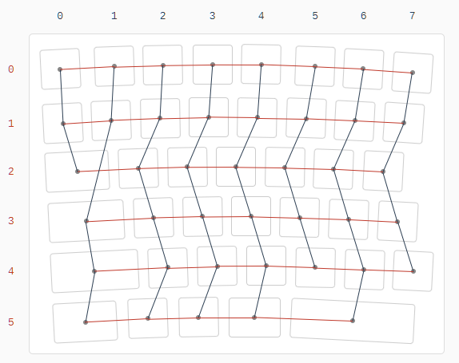.

Выбираем капслок слева, меняем столбец на "1", делаем то же самое с шифтом, контролом и матрица уже лучше:
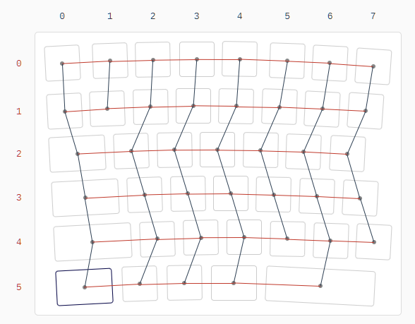

Сохраняем картинку матрицы: она пригодится если есть желание заниматься навесным монтажом. В случае навесного
монтажа схему печатаем и поверх неё подписываем на какие ноги процессора подключим потом для воспроизведения
результата. Нажимаем "Compile". Если планируем делать плату -- скачиваем сгенерированный zip файл.

В любом случае сохраняем `#define` который нам выдали в отдельном месте -- он понадобится позднее для
создания прошивки. Повторяем процесс для второй половины. Пора делать разводку.

### Создание печатной платы

Я буду расписывать что надо сделать в мельчайших подробностях так, чтоб читатель (и будущий я сам) смог
повторить без особого опыта в использовании соответствующего софта.

Скачиваем последний [KiCAD](https://www.kicad.org/) (на момент написания -- 6.0) и открываем `keyboard.pro` из
сгенерённого архива. Затем доустанавливаем необходимые плагины и библиотеки:
  1. Меню `Tools --> Plugin and Content Manager`, на вкладке "Plugins" находим и помечаем "PCBWay Plug-in for
     KiCad" а со вкладки "Libraries" помечаем "Keyswitch Kicad Library". Жмем "Apply changes" и KiCAD поставит
	 всё выбранное.
  2. Нам еще понадобится плагин kicad-kbplacer. Он был не совместим с 6м KiCAD'м плюс мне понадобилось
	 несколько правок к нему поверх. Скачиваем [kicad-kbplacer.zip](https://github.com/datacompboy/kicad-kbplacer/blob/master/release/kicad-kbplacer.zip),
	 идем опять в "Plugin and content manager" и ставим его используя "Install from file".
  3. Следуем инструкциям по ссылке [KiCad-RP-Pico](https://github.com/ncarandini/KiCad-RP-Pico) для установки
	 элементов RPi Pico. Зарубка на будущее: для RP2040 Zero неплохая библиотека [тут](https://github.com/crides/kleeb).
  4. Еще может потребоваться дополнительная библиотека для стабилизаторов. Не сегодняшний день я не знаю какая
     именно! Я использовал наплатный стабилизатор для PG1350 из набора 
     [Keebio parts](https://github.com/keebio/Keebio-Parts.pretty) но с ними выяснились проблемы, про которые и
     преодолении которых я расскажу в следующих частях (tl;dr: они не подходят для размещения на печатной плате,
     так что потребовалось распечатать адаптеры...)

Вот теперь всё готово. Начинаем с открытия `keyboard.sch` двойным кликом в списке файлов проекта -- нам надо
добавить на схему процессорный модуль. Исходная схема после генератора выглядит так: 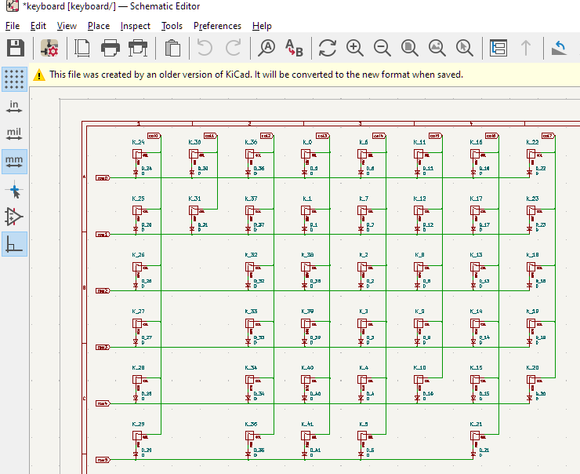

Нажимаем `A` (`Place --> Add symbol`), фильтруем список по "Pico" и добавляем модуль из списка. Перемещаем
по схеме нажатием "M", перемещением мыши куда надо а потом подтверждаем Enter. Отменяем режим добавления
элементов нажатием Esc. Двойным кликом открываем свойства добавленного модуля, редактируем поле "Reference",
где меняем "U?" на "Pico0".

Еще нужно подключить матрицу к процессору -- я ленивый, поэтому просто занимался копипастой маркеров сети
(это такие пятиугольнички помеченные col0/row1 и т.п.) прямо на ножки процессора. Делается это так: клик на
маркер, ctrl+c, ctrl+v, повернуть с помощью `r` если надо, переместить так чтоб стрелочка коснулась ноги.
Повторить для каждого маркера. Результат: 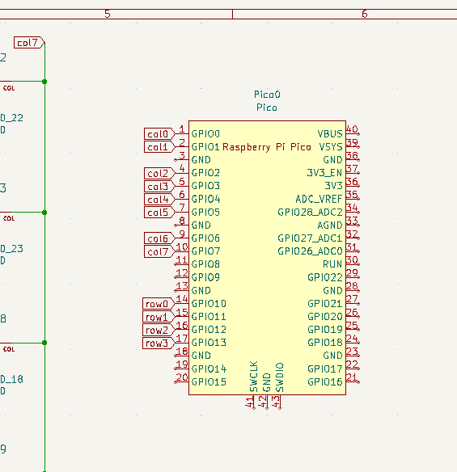

О! Потребуется же еще связь со второй половиной. Добавляем еще один элемент -- "Conn_01x04". Так же двойным
кликом заходим в свойства, делаем его "Reference" равным "Link0". Подключаем к разъёму линии VSYS, GND и
TX/RX от какого-либо UART порта. Какие ноги могут работать портами можно посмотреть на схеме [RPi Pico
pinout](https://www.electrorules.com/raspberry-pi-pico-pinout-specification-and-features/).

Полученная схема теперь выглядит так: 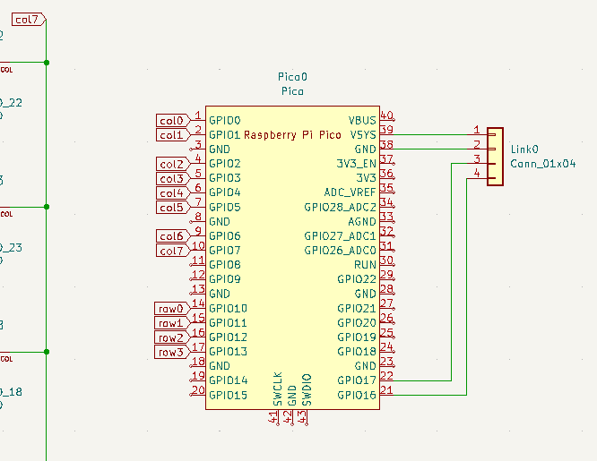.

Сохраняем схему и через "Open PCB in board editor" переключаемся в редактор платы (ну либо закрываем редактор
схем и двойным кликом в списке файлов проекта открываем pcb файл). Да, свичи не повернуты, сдвинуты куда-то
за край, площадки для свичей другого типа. Исправляем: выбираем и удаляем рамку вокруг блока свичей (не
забываем еще удалить малозаметные точки в углах).

Теперь выбираем один из свичей (щелчком где-то рядом с его именем вида "K_24") так что выделяется весь свич.
`Edit --> Change Footprints`. Ставим радиокнопку на "Change footprints with library id", щелкаем на символ
библиотеки рядом с "New footprint library id". В поле поиска вводим "Switch", выбираем строку "Hotswap_Kailh".
Из второго списка выбираем символ подходящего размера свича. То есть правильная замена для исходно
`MX_Alps_Hybrid:MX-1U-NoLED` будет `Switch_Keyboard_Hotswap_Kailh:SW_Hotswap_Kailh_Choc_V1V2_1.00u`.
Нажимаем "Change": 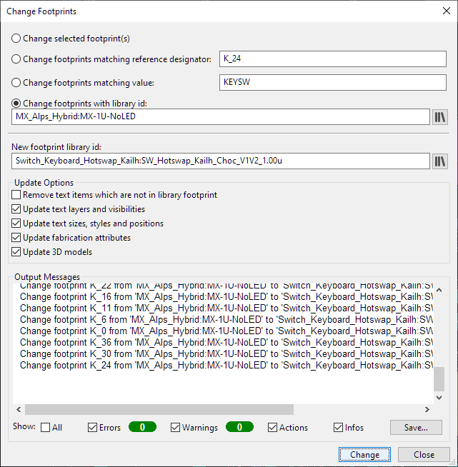. 

Теперь на плате все свичи этого типа стали правильными: 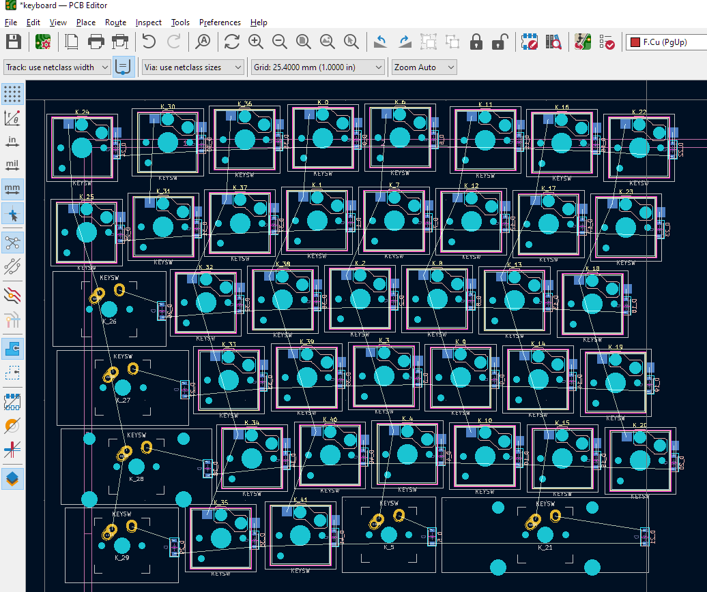. Повторяем для остальных
размеров.

Следом надо добавить стабилизаторы для клавиш которые их требуют (я их добавил для клавиш от размера 1.75 и
выше -- но сомневаюсь что 2u стабилизаторы будут хорошо работать для 3u клавиш или больше). Чтобы добавить их
опять идём в `Place --> Add Footprint`, выбираем "Stab-PG1350-2u", размещаем его так, чтобы центральное
отверстие совпало с центральным отверстием площадки свича. Двойным щелчком в свойствах меняем "Reference" на
"ST_XX" (где XX совпадает с номером клавиши -- то есть для клавиши K_21 стабилизатор должен быть ST_21).
Проходимся по всем большим клавишам. (Еще западня с этими стабилизаторами: у них есть два возможных размещения.
Одно размещение когда центр между большими квадратами на уровне отверстия свича, при этом нижний квадрат
получается ниже нижней границы свича -- это расположение подразумевает что крестовины стабилизации на крышках
должны быть отцентрованы по вертикали. При втором размещении нижняя граница нижнего квадрата находится на
уровне нижней границы свича, при этом крестовины стабилизации на крышках должны быть смещены немного вверх --
крышки на которые я дал ссылки выше как раз такие).

Как только все необходимые элементы размещены на плате можно поправить расположение. Для этого потребуется
отконвертировать json  скачанный с KLE во внутренний формат который понимает KeyAutoPlace. Сконвертировать
можно на http://keyboard-tools.xyz/ раздел "KLE converter", грузим JSON из KLE и скачиваем сконвертированный.
Возвращаемся в редактор плат, `Tools --> External Plugins --> KeyAutoPlace`. Выбираем сконвертированный Json
файл в 1е поле, правим "key annotation format string" ==> "K_{}", "stabilizer annotation format string" ==>
"ST_{}" и "diode annotation format" ==> "D_{}". Снимаем галочку "add tracks" и ставим "0-based numeration".
Жмем OK => вуаля! (игнорируем болтающиеся по экрану линии, их там нет :)

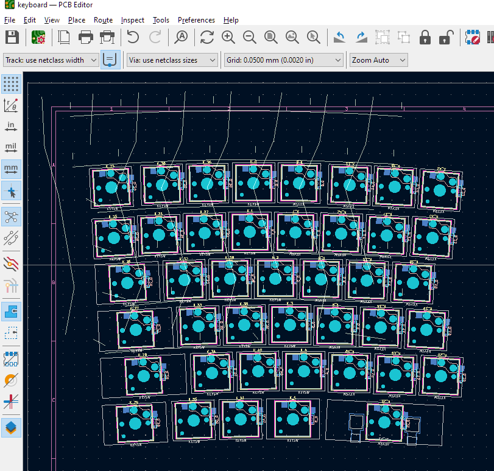 

Добавляем еще два элемента для "Pico0" процессора и "Link0" разъёма. Для этого опять пользуем
`Place --> Add footprint` ищем "RPi-Pico_SMD_TH", размещаем, двойным кликом меняем "Reference" на "Pico0".
Добавляем 4-ногий разъём по своему усмотрению. Как я говорил выше, я уже заказал JST разъём:
"JST_SH_SM04B-SRSS-TB_1x04-1MP_P1.00mm_Horizontal". Меняем его "Reference" на "Link0".

Теперь надо просинхронизовать схему и платы чтобы появились соединения к модулям и разъёму. Нажатием на F8
(или через меню `Tools --> Update PCB from Schematic`) открываем диалог, убеждаемся что стоит крыжик
"Re-link" а крыжики "Delete" и "Replace" сняты, жмем "Update PCB". Ошибок быть не должно (предупреждения
будут). После этого на экране обновятся все связи между свичами, процессором и разъёмом. Но надо сперва
еще просинхронизовать в обратную сторону, от платы к схеме. Жмем в меню`Tools --> Update schematic from PCB`.
Должна быть только ругань на стабилизаторы -- просто игнорируем. Нажимаем "Update Schematic".

Так как нужна матрица соединений, простейший вариант её отрисовки это нарисовать ряды и колонки на разных
сторонах платы. А для этого потребуются переходные отверстия, а я же решил использовать hotswap слоты,
которые крепятся на одну сторону платы. Не вопрос, зумимся на какую-либо кнопку и выделяем кликом первый
контакт hotswap слота (тот на котором нарисовано "1" и "col0"), двойным кликом заходим в настройки и меняем 
тип площадки с "SMD" на "Through-hole", а для "Hole size X" ставим что-нибудь разумное -- я выбрал 1.2мм.
После "OK" площадка поменялась на отверстие. Один готов, еще 41 поменять :) выбираем (через shift+click)
все первые площадки всех свичей, идём в меню правой кнопки мыши и выбираем `Paste Default Pad Properties to Selected`.

Готово, рисуем матрицу. Заходим в меню `File --> Board setup`, идем в Net Classes и ставим ширину дорожки
по умолчанию в 1мм (если очень хочется можно и 0.25мм оставить -- для клавиатуры это совершенно неважно).
Я еще добавил два заготовленных размера в 0.75мм и 0.5мм. Жмем "ok" и можем приступать к рисованию!

Выбираем слой. Так как диоды на обратной стороне, слой `B.Cu` будет используется для строк и диодов, а
`F.Cu` для столбцов (переходные отверстия были как раз для него заготовлены). так что выбираем слой `F.Cu`,
кликаем на начало дорожки, жмем "X" (`Route --> Route Single Track`), ведём к следующей точке, где либо
кликаем мышью чтобы закончить либо жмем "X" опять чтобы продолжать. Как все столбцы отрисованы, выбираем
`B.Cu` слой  (не обязательно: так как диоды и вторые ножки на обратной стороне, при попытке нажать "X"
для отрисовки дорожки, слой `B.Cu` выберется автоматически). Я сперва подключил все диоды и потом соединил
ряды матрицы. Вот как выглядит результирующая матрица: 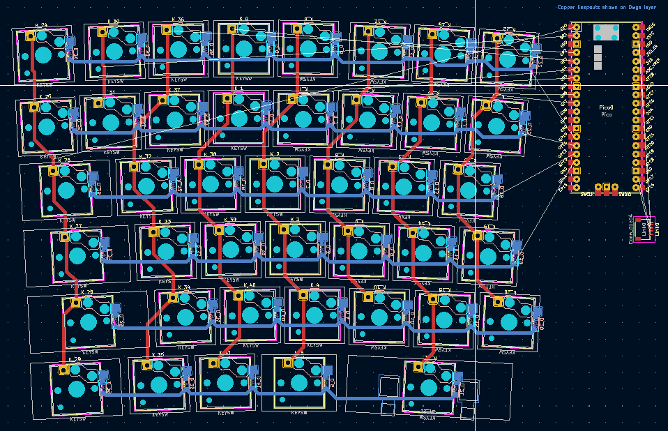

Следующим шагом надо определиться с размером платы -- контроллер стоит разместить на границу, чтобы подключать
кабель было удобно. Так что рисуем прямоугольник на слое `Edge.Cuts` и перемещаем контроллер и разъём на
границу. Совершенно не обязательно подключать линии именно к тем ножкам которые были определены ранее на
схеме -- всегда можно подвести куда удобно, переключиться на схему, переместить подключение к новой ноге,
сохранить и в редакторе платы через F8 обновить карту соединений. Я еще добавил элементы "Mounting Hole"
размером в 2.2мм по углам. Первый блин вышел комом -- не следовало проводить дорожки по границе платы,
стоило просто внять где-нибудь из середины про подключать ближе. В общем, разводка на левой и правой
половине ощутимо разная, но расстояние между верхним свичом до границы платы выдержано одинаковым в 6мм,
так что рамка будет однаковая. Финальный вид платы: 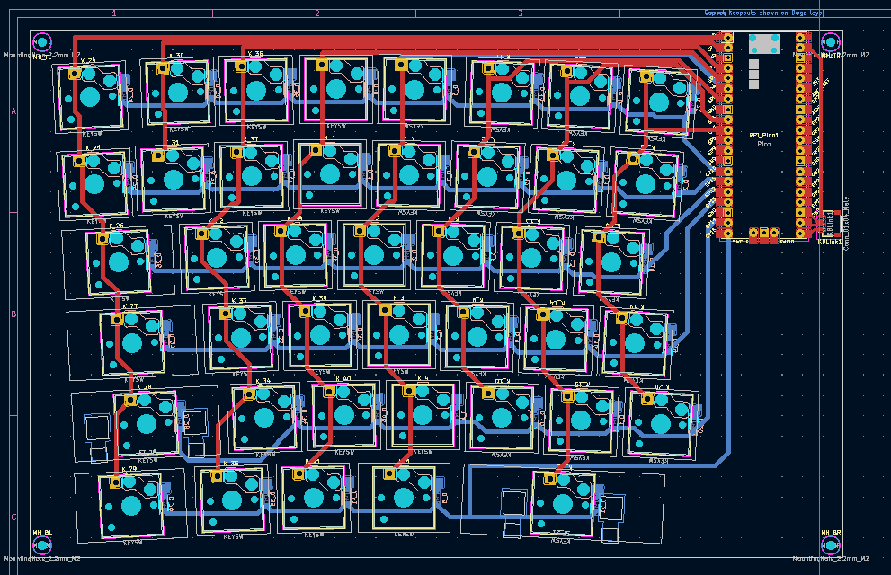

Затем надо через `Inspect --> Design Rules Checker` проверить на ошибки дизайна. У меня были следующие:
  - Дублирование сверловки в элементе свича. Наверное, можно и проигнорировать, но я прошелся по всем
	свичам для каждого нажимая Ctrl+E, щелкнуть по отверстию, из выпадашки выбрать одно из них и удалить
	нажатием на "Del", сохранить.
  - Дублирование сверловки от стабилизатора. Тот же подход -- выбрать стабилизатор, Ctrl+E, удалить
    центральное отверстие.
  - Непрорисованые линии (диод не подключен коротким хвостом) либо дублированные линии либо линии нулевой
    толщины. Пройтись по всем и дорисовать либо удалить лишнее.

Как только DRC не выдаёт ни ошибок ни замечаний -- всё готово!

Важно не забыть: для соединения левой и правой половин я купил кабель с прямой обжимкой, поэтому назначения
ног в разъёме идут наоборот (то есть 1-2-3-4 получается подключен к 4-3-2-1). Поэтому важно убедиться что
+5 на одной стороне идёт к +5 на другой стороне с учетом этого, GND к GND а последовательные ноги идут RX
к TX и наоборот.

На гитхабе лежат итоговый [проект](https://github.com/datacompboy/split-keyboard/tree/main/pcb) и
[архивы](https://github.com/datacompboy/split-keyboard/tree/main/pcb-bin) через которые я заказывал платы.

Как только дизайн обеих половин готов -- заказываем. Для этого я воспользовался плагином от PCBWay который
подготавливает ZIP файл в нужном наборе и загружает его на PCBWay чтобы показать стоимость. Оттуда его
можно сразу же скачать и загрузить на другие сервисы для сравнения. Я попробовал все три самых популярных:
PCBWay, JLCPCB и NextPCB, сравнил стоимость и сроки изготовления и доставки.

В моем случае JLCPCB победил, обе половины были заказаны тут.

<!-- --------- Chapter 2 cut

## То ли еще будет!

Прошлая часть [previous chapter] рассказывает почему я решил делать полностью свою клавиатуру и как получена
была раскладка.

В следующей части будет собраны вместе аппаратная и програмная части и можно будет уже печатать.

4я часть предназначена для корпусирования клавиатуры.

А в последней, 5й, части я расскажу о разработке и изготовлении крышек.

--------- Chapter 3 start -->

## Часть 3: оживляем её!

Опубликована на [Habr][ch3-habr], [Medium][ch3-medium] и [LinkedIn][ch3-lin].

[ch3-medium]: https://medium.com/@datacompboy/building-my-own-ergo-keyboard-make-it-live-f9613b0b266a?source=friends_link&sk=d954dbbc2644797aac14fa8038811ed5
[ch3-lin]: https://www.linkedin.com/pulse/building-my-own-ergo-keyboard-p3-make-live-anton-fedorov/
[ch3-habr]: https://habr.com/ru/post/671034/

<!--
В [предыдущей части] были заказаны для клавиатуры платы и все её детальки. Они, конечно же, все приехали и
настало время смешать всё вместе и вдохнуть жизнь с помощью свежепротранслированной прошивки. Если вы
пропустили о чем речь — загляните в [первую часть].
-->

### Сборка клавиатуры

Теперь все детали в наличии, пришла пора собрать всё вместе -- что потребует по крайней мере паяльника,
флюса и припоя. Я рекомендую иметь под рукой так же какой-либо тестер/мультиметр (прозвонка линий или омметр
для проверки качества пайки, тестер диодов для проверки полярности после пайки). Так как я заказал SMD диоды,
мне ещё понадобится лупа. Для удобства еще нужна "Третья рука" и дополнительное освещение.

Так что я заказал ещё инструментов:

  * [FixPoint 51226]: "третья рука" с лупой, подсветкой и подставкой для паяльника. База оказалась конечно
    тяжелая, но недостаточно для сборки клавиатуры из-за её размеров, так что использовал стаканчики как
	подпорки под плату. Крокодилы третьей руки не покрыты ничем прорезиненным, так что они впиваются и царапают
	плату. Учитывая размер плат, я не попробовал подставку под паяльник -- использовал отдельную чтобы держать
	его в стороне.
  * [JCD 908U Kit]: набор всё-в-одном для пайки поделок: не самый плохой паяльник (100 ватт, очень быстро
    греется, набор разных голов -- да, не самых лучших, но для валяния в подвале годами -- сойдут), мультиметр,
    подставка, твердый флюс, флюс-паста, пинцет, инструмент для отпайки и всё вместе в небольшом складном
	чехле. Сам паяльник мне показался достаточно неплохим для эпизодической пайки, а вот к самому набору есть
	претензии: инструмент для отпайки отсутствовал (вместо него лежит отпаечная оплётка), флюс-паста протекла
	из коробки замазав всё вокруг (легко убралось тряпочкой и 70% спиртом). В общем, чувства остались смешанные:
	по цене самого дешевого паяльника что я могу купить рядом с домом я получил паяльник мощнее и качеством
	выше, да еще в довесок разных полезных вещей для пайки -- так что спор на Али я не открывал.

К сожалению, заказанный паяльник еще не пришел к тому моменту как пришли все детали и платы, надвигались
выходные -- пришлось занять простой паяльник с мультиметром у коллеги, живущего рядом, чтобы собрать всё
на выходных.

Пришлось заказать/сходить до магазином за припоем и флюсом:

  * [CFH Electronic solder EL 324]: удобный и простой в использовании припой. Немного толстоват (1мм) но со
    флюсом внутри, что позволяет легко им паять. Я еще заказал [Goobay Professional lead-free solder] ради
	его 0.35мм диаметра, не так и не попробовал -- мой страх что пайка будет плохая из-за толстого припоя
	оказался беспочвенным. Пайка была плохая из-за моих плохих навыков пайки :)
  * [CFH Flux FM 342]: самый обычный флюс-паста, единственный что я нашел в супермаркете рядом.

Рабочий коврик уже был дома, а потому можно приступать к работе! Подготавливаем рабочее место: в центре
рабочее пространство с ковриком, 3я рука и свет, все детали слева, паяльник и пинцеты справа. Как-то вот так:

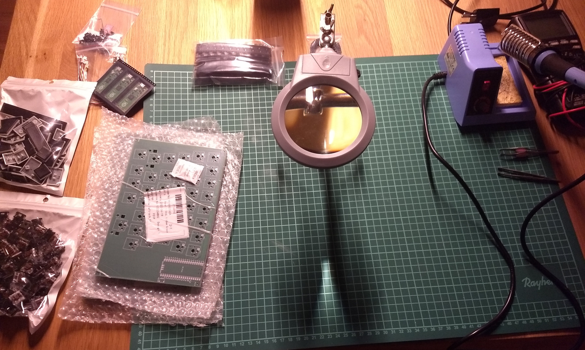

И да я растерял все остатки моих паяльных навыков :( Качество результата пропайки мне не понравилось, я даже не
припаял один из диодов (просто повесив каплю ему на бок) и не заметил этого даже на тестовой прозвонке линий.
Я не пришел к выводу что же лучше: сперва припаять hotswap сокеты или диоды первыми...

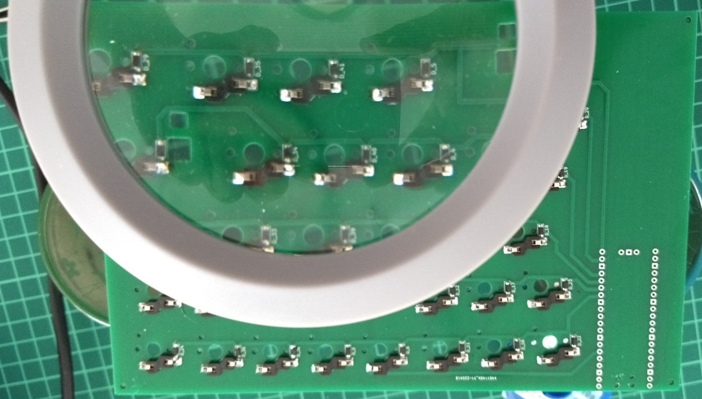

Важно: сокеты немного асимметричны, одна сторона квадратная а другая восьмиугольник который позволяет легче
размещать там диод. Впрочем, диод влезает всё равно. И обязательно прозвонить все линии и все диоды после
сборки и исправить непропай или полярность сразу же, пока еще паяльник горячий и все на столе.

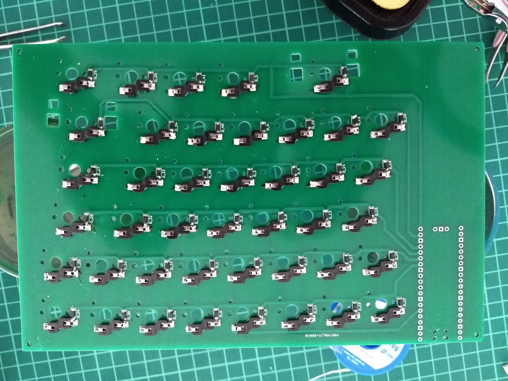

После сборки и прозвонки матрицы переворачиваем плату и напаиваем процессорный модуль. Осталось вставить свичи:

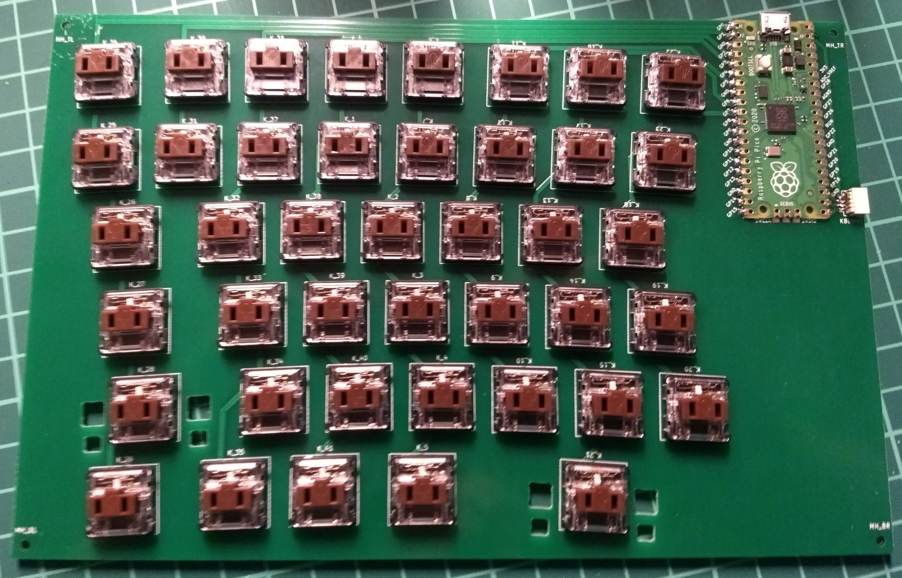

После сборки основы надо прикрепить крышки и стабилизаторы...

... вот тут-то я и выяснил что у стабилизаторов есть два способа их размещения, и крышки заказанные не совпадают
с размещением стабилизатора на плате. По сравнению со Stab элементом их надо бы сдвинуть на почти 3мм.

... но это неважно, поскольку высоты стабилизаторов недостаточно, они не подходят для случая когда свичи
размещены на печатной плате! Они заточены для размещения свичей *В* плате. Впрочем, возможно они подойдут для
ультра-тонких бабочек... В общем, со стабилизаторами разберёмся в последней части, а на пока я решил "пусть
будет так" и пошел разбираться с прошивкой.

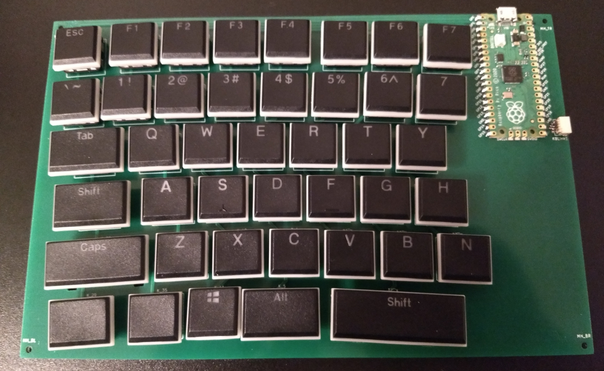

[FixPoint 51226]: https://www.galaxus.ch/en/s1/product/fixpoint-third-hand-soldering-aid-with-magnifying-glass-and-holder-supporthand-soldering-iron-access-12500037?supplier=406802
[JCD 908U Kit]: https://www.aliexpress.com/item/1005003663173613.html
[CFH Electronic solder EL 324]: https://www.galaxus.ch/en/s4/product/cfh-electronic-solder-el-324-lead-free-70g-soldering-irons-18492591
[Goobay Professional lead-free solder]: https://www.galaxus.ch/en/s1/product/goobay-professional-lead-free-solder-solder-soldering-iron-accessories-12500052?supplier=406802
[CFH Flux FM 342]: https://www.jumbo.ch/de/loetfett-cfh-33392

### Сборка прошивки

Просто собрать матрицу и подключить её к процессору недостаточно, чтобы получить клавиатуру. Она еще должна быть
видна в системе как клавиатура и работать как клавиатура. Что ж, ей нужна прошивка.

В поисках софта для создания клавиатур на базе RP2040 я наткнулся на пару своеобразных проектов:

  * https://github.com/KMKfw/kmk_firmware -- прошивка на python.
  * https://github.com/picoruby/prk_firmware -- прошивка на ruby.

У меня есть опыт работы низкоуровневым программистом и идея использовать интерпретируемый язык на
микроконтроллере просто для запуска бесконечного цикла сканирования матрицы вызывает чувство глубокого внутреннего
противоречия. Да, так можно. Нет, идея мне не нравится :) Так что приходим к следующему варианту:

  * https://github.com/qmk/qmk_firmware -- прошивка на Си.

Проект [QMK](https://qmk.fm) меня порадовал: множество готовых фич но после сборки остаётся только то, что
потребовалось. Эта прошивка явно будет более экономична по питанию а потому меньше беспокоить меня. Одна проблема:
не поддерживает RP2040. Пока ещё.

Поскольку модуль очень дешевый и многоногий, он прекрасен для создания клавиатур (особенно со светодиодами,
экранчиками и проч, когда надо много ног) [фич-реквест][qmk/issue/11649] уже открыт. И @KarlK90 уже подготовил
[пулл-реквест][qmk/pull/11649] с поддержкой его.

А значит, уже можно воспользоваться!

[qmk/issue/11649]: https://github.com/qmk/qmk_firmware/issues/11649
[qmk/pull/11649]: https://github.com/qmk/qmk_firmware/pull/14877

#### Устанавливаем QMK

Чтобы поставить QMK под Windows, простейший способ это поставить подготовленную сборку MSYS с сайта
https://msys.qmk.fm/. После установки запускаем "QMK MSYS" -- все команды указанные ниже запускались в ней..

Сперва, нам понадобится сам QMK с поддержкой RP2040. Поэтому установку запускаем из соответствующего форка
(когда пулл-реквест будет слит, из команды следует убрать всё начиная с `-b`). Поправьте путь для директории
куда ставить под себя.

```bash
$ qmk setup -H D:/Keyboard/qmk_firmware -b feature/raspberry-pi-rp2040-support KarlK90/qmk_firmware.git
...
Would you like to set D:/Keyboard/qmk_firmware as your QMK home? [y/n] y
Ψ QMK Doctor is checking your environment.
Ψ CLI version: 1.0.0
Ψ QMK home: D:/Keyboard/qmk_firmware
Ψ Detected Windows 10 (10.0.19044).
Ψ Git branch: feature/raspberry-pi-rp2040-support
Ψ Repo version: 0.9.43
Ψ All dependencies are installed.
Ψ Found ...
Ψ Submodules are up to date.
Ψ QMK is ready to go
```

Надо набраться терпения, скачивание репозитория и всех сабмодулей потребует времени. После пробуем посмотреть
как создать новую клавиатуру:

```bash
$ qmk new-keyboard -h
```

... и выясняем что нужны еще пакеты `wheel` и `Pillow`. Их можно доставить запустив:

```bash
$ pacman -S mingw-w64-x86_64-openjpeg2 
$ pacman -S mingw-w64-x86_64-zlib
$ pacman -S mingw-w64-x86_64-freetype 
$ pacman -S mingw-w64-x86_64-libimagequant 
$ pacman -S mingw-w64-x86_64-libraqm
$ pip3 install --upgrade wheel
$ pip3 install --upgrade Pillow
```

Всё, все зависимости стоят, qmk работает, приступаем к сборке.

#### Создание прошивки для одной половины.

Самая пора выбрать название для клавиатуры. Выдавать названия это самое сложное в программировании вообще.
Я назвал её `dacobokb` как удобное, легко запоминаемое и краткое.

Клавиатура состоит из двух зависимых половин и самое простое чтобы заставить всё работать в сборе это идти
по нарастающей. Сперва надо создать прошивку для одной половины, убедиться что всё железо работает, и уже
потом думать о том как заставить половины работать вместе. К тому же, у меня пока только одна половина собрана.

Итак, создаём заготовку для прошивки. Так как я раскладку рисовал начиная с полноразмерной, для прошивки
тоже беру `fullsize_ansi` как основу.

```bash
$ qmk new-keyboard -u datacompboy -n "Anton Fedorov" -l fullsize_ansi -t RP2040 -kb dacobokb_l
```

В директории `D:\Keyboard\qmk_firmware\keyboards\dacobokb_l\` были созданы необходимые файлы, причешем их.
Открываем `D:\Keyboard\qmk_firmware\keyboards\dacobokb_l\` как директорию проекта в [Notepad++] (или любом
другом редакторе на свой вкус).

 1. Правим файл `rules.mk`. Вот всё нужное содержимое:

   ```makefile
   MCU = RP2040
   ```

 2. Правим `info.json`. Чтобы заработало, надо выставить процессор в "RP2040", загрузчик в "custom" и задать
    ножки к которым подведена была матрица плате. (А если распаяно вручную -- вы же записали на распечатке
	матрицы к каким ногам её подвели, да?)
	
	```json
	{
		...
		"bootloader": "custom",
		"processor": "RP2040",
		"matrix_pins": {
			"cols": ["GP0", "GP1", "GP2", "GP3", "GP4", "GP5", "GP6", "GP7"],
			"rows": ["GP10", "GP11", "GP12", "GP13", "GP14", "GP15"]
		},
		...
	}
	```
	
	Раздел раскладок "layouts" можно просто стереть -- а можно на https://qmk.fm/converter/ вставить содержиме
	влкадки "raw data" с KLE в поле "Input" -- и из поля "output" скопировать строку `"layout": [...]` и
	заменить ею в `info.json`.
	
	В целом можно использовать любые pid/vid, но лучше избегать конфликтов, так что на странице
	https://pid.codes/1209/ есть список зарезервированных PIDов внутри VID 1209 выделенного для опенсорса. Там же
	размещена инструкция как зарезервировать один для своего проекта, если планируется его распространение. Если
	нет, то просто взять что-нибудь свободное для себя и всё.
	
 3. Создаём файл ".h" для макроса перевода раскладки -- файл называем как клавиатуру. То есть я создал файл
    `dacobokb_l.h`. Вот именно сейчас потребуется сгенерированный ранее `#define`. Копипастим его как нам
	выдали.
	
	```c
	#pragma once
	#include "quantum.h"
	
	// Copy-paste the #define macro that was earlier generated at the matrix PCB generation.
	#define LAYOUT( \
		K00, K01, K02, K03, K04, K05, K06, K07, \
		K10, K11, K12, K13, K14, K15, K16, K17, \
		K20,      K22, K23, K24, K25, K26, K27, \
		K30,      K32, K33, K34, K35, K36, K37, \
		K40,      K42, K43, K44, K45, K46, K47, \
		K50,      K52, K53, K54,      K56  \
	) { \
		{ K00,   K01,   K02,   K03,   K04,   K05,   K06,   K07 }, \
		{ K10,   K11,   K12,   K13,   K14,   K15,   K16,   K17 }, \
		{ K20,   KC_NO, K22,   K23,   K24,   K25,   K26,   K27 }, \
		{ K30,   KC_NO, K32,   K33,   K34,   K35,   K36,   K37 }, \
		{ K40,   KC_NO, K42,   K43,   K44,   K45,   K46,   K47 }, \
		{ K50,   KC_NO, K52,   K53,   K54,   KC_NO, K56,   KC_NO }  \
	}
	```
	
 4. Редактируем раскладку в `keymaps/default/keymap.c`, чтобы она соответствовала желаемой. Мне показалось удобным
	для читаемости переименовать слои, так что я добавил пару констант для базы и для Fn слоёв.

	```c
	#define _BL 0
	#define _FL 1
	```
	
	Затем поправил `[0] = LAYOUT...` на `[_BL] = LAYOUT(` и отредактировал назначенные клавиши для текущей
	половины. Поскольку раскладка базируется на полноразмере, в основном просто надо было удалить лишние клавиши
	и добавить Fn. Чтобы определить Fn клавишу воспользовался `MO(_FL)` (создал `MO`дификатор на `Fn-Layer`).
	Следом определил слой для Fn клавиш, добавив еще один элемент массива, где все Fn функции внесены, а
	остальные места заполнены `_______`, что означает "использовать значение со слоя ниже". Все слои требуют
	определять все клавиши.
	
	```c
	[_FL] = LAYOUT(
		KC_CALCULATOR, KC_AUDIO_MUTE, KC_AUDIO_VOL_DOWN, KC_AUDIO_VOL_UP, KC_MEDIA_PREV_TRACK, KC_MEDIA_PLAY_PAUSE, KC_MEDIA_NEXT_TRACK, _______,
		_______, _______, _______, _______, _______, _______, _______, _______,
		...
	),
	```
	
Получившиеся файлы для половины [лежат у меня на github](https://github.com/datacompboy/split-keyboard/tree/main/qmk-keyboard/dacobokb_l)

После окончания редактирования, компилируем прошивку:

```bash
$ qmk compile -kb dacobokb_l -km default
Ψ Compiling keymap with make --jobs=1 dacobokb_l:default


QMK Firmware 0.9.43
Making dacobokb_l with keymap default
...
Generating: ...
Compiling: ...
Assembling: ...
and finally:
Linking: ...
Linking: .build/dacobokb_l_default.elf                              [OK]
Creating load file for flashing: .build/dacobokb_l_default.hex      [OK]
Creating UF2 file for deployment: .build/dacobokb_l_default.uf2     [OK]
Copying dacobokb_l_default.uf2 to qmk_firmware folder               [OK]
```

Всё, прошивка готова. Зажимаем маленькую кнопочку на RP2040 модуле, подключаем USB провод, отпускаем кнопочку --
в системе появляется новый диск (у меня E:\). Чтобы залить прошивку просто копируем её туда:

```bash
$ cp D:/Keyboard/qmk_firmware/dacobokb_l_default.uf2 E:/
```

Файл копируется практически моментально, процессор перезагружается в режим клавиатуры и определяется в системе.
Проверяем все клавиши в поисках тех, что не хотят работать. (Ага, у меня оказалась одна на левой -- непропай
диода и позднее одна на правой -- непропай сокета). Поскольку всё работает -- собираем вторую половину клавиатуры
(и железо и прошивку).

К слову: протестировать Fn слой на левой половине можно напрямую (кнопка Fn там расположена), а вот на правой
нужно либо временно переопределить в прошивке что-нибудь как `MO(_FL)` или дождаться когда будет готова прошивка
для полной клавиатуры.

Кстати да, пора уже объединить половины!

[Notepad++]: https://notepad-plus-plus.org/downloads/

#### Собираем прошивку для распиленной полной клавиатуры

QMK поддерживает работу распиленной клавиатуры когда любая из половин подключена по USB а другая соединена с ней
по отдельной последовательной линии и передаёт ей результат опроса своей матрицы. На самом деле там чуть больше,
чем только опрос матрицы (передача информации о модификаторах, управление подсветкой и проч) но для моей
клавиатуры ничто больше не требуется -- только чтобы Fn с левой половины работал на обеих.

У проекта есть некоторая документация о поддержке распиленых клавиатур: https://docs.qmk.fm/#/feature_split_keyboard,
но бОльшую часть можно выяснить читая исходники. Как я понял (поправьте если я ошибаюсь!), у QMK есть следующие
предположения:

  - Определение какая половина основная какая дополнительная идет либо по USB питанию либо по USB подключению.
  - Обе половины соединяются через одни и те же RX/TX пины / UARTы / I2C линии.
  - У обеих половин одинаковое количество строк и столбцов, но они могут быть подключены к разным ногам.
  - Прошивка определяет левая/правая половина на основании одного из:
	 - Состояния определённой ножки при запуске;
	 - Состояния USB при запуске;
	 - По чтению состояния замкнутости (впаянный диод) на одном из пересечений матрицы.

Поскольку я рисовал платы еще не зная ничего из этого, мои платы:
  - левая и правая половины используют разные ноги для связи и они взяты с разных UARTов,
  - на левой и правой половине разное количество столбцов,
  - ряды и столбцы обеих половин заведены на разные ноги процессора так, что не осталось ни одной
    неиспользованной ноги и ни одна нога не пересекается между половинами.

Может, конечно, и можно найти общую дырку в матрице, чтобы на одной из половин её замкнуть диодом, но это не
повлияет на факт того, что всё остальное всё равно уникально для половин, а потому нет смысла даже искать. Надо
найти способ собрать уникальную прошивку для каждой половины так, чтобы они могли работать вместе. Я подумаю как
сделать лучше в другой раз.

Настройки которые я привожу тут предполагают что будет использоваться аппаратный UART (драйвер "usart" из
rules.mk и "SIO" из chibios).

 0. Копируем всю папку одной из прошивок для половины как базу для общей (я скопировал `dacobokb_l` ==> `dacobokb`).

 1. Правим `rules.mk`, чтобы добавить еще две строчки для включения режима распила и UART драйвер "usart"
 
	```makefile
	MCU = RP2040
	SPLIT_KEYBOARD = yes
	SERIAL_DRIVER = usart
	```
	
 2. Редактируем `info.json`, чтобы убрать оттуда `matrix_pins`: я не нашел способа задать разные ноги для половин
	через него. Еще можно удалить layouts или добавить от обеих половин.

 3. В `config.h` самые важные правки. Поскольку `matrix_pins` из `info.json` убрали, теперь все ноги задаются
	здесь, плюс нужно выбрать правильный драйвер для использования. в общем, добавляем важных дефайнов:
	
	```c
	#pragma once
	#include "config_common.h"
	
	// Left half should have two fake columns to make left & right matrix equals
	#define MATRIX_COL_PINS       { GP0,  GP1,  GP2,  GP3,  GP4,  GP5,  GP6,  GP7,  GP7,  GP7 }
	#define MATRIX_ROW_PINS       { GP10, GP11, GP12, GP13, GP14, GP15 }

	#define MATRIX_COL_PINS_RIGHT { GP16, GP3,  GP2,  GP17, GP18, GP20, GP21, GP22, GP27, GP28 }
	#define MATRIX_ROW_PINS_RIGHT { GP26, GP19, GP4,  GP13, GP14, GP15 }

	#define SPLIT_USB_DETECT
	#define SPLIT_LAYER_STATE_ENABLE
	#define SERIAL_USART_FULL_DUPLEX
	#define HAL_USE_SIO  TRUE
	```

	Внимательный читатель заметит, что последний столбец для левой повторен трижды -- это выравнивает количество
	столбцов на левой и правой половинах, но любые нажатия там будут подавлены через KC_NO, так что всё будет
	работать как надо.

	Последние строки включают определение первичной клавиатуры по наличию USB соединения, обмен состоянием активного
	слоя между половинами (надо только для индикации, так как обработка для передач на компьютер идёт всегда на
	головной половине) и задают протокол обмена UART full-duplex через драйвер ChibiOS "SIO".

 4. Переименовываем заголовочный файл клавиатуры в новое имя (`dacobokb_l.h` ==> `dacobokb.h`) и меняем дефайн
	в нём так, чтобы задавал раскладку работал для полной клавиатуры из двух половин. Это делается потому, что
	основная половина занимается переводом нажатия в сигналы клавиш для обеих половин разом, а значит должна знать
	всю раскладку разом.

	Я просмотрел имеющиеся раскладки и в основном там задается макрос когда все клавиши для половин заданы в ряд:
	
	```c
	#define LAYOUT( \
		L01, L02, L03, L04,    R01, R02, R03, R04, \
		L11, L12, L13, L14,    R11, R12, R13, R14 \
	) { \
		{ L01, L02, L03, L04 }, \
		{ L11, L12, L13, L14 }, \
		{ R01, R02, R03, R04 }, \
		{ R11, R12, R13, R14 } \
	}
	```
	
	но у меня половины имеют разное число столбцов, плюс у меня уже есть два отдельных макроса и готовые
	раскладки, поэтому я пошел другим путём -- я просто склеил их последовательно, тем более, что внутри QMK
	хочет как раз такой формат. Чтобы выровнять размеры матриц для левой добавил по две KC_NO в каждой строке.
	Мне еще повезло что генератор дефайна для левой половины из-за того что столбцов всего 8, использовал одно
	знакоместо под номер столбца (`Kxx`) а для правой, где 10 столбцов, он использовал два знакоместа (`Kxxx`),
	так что никаких конфликтов в аргументах макро не было. Если бы были -- поменял бы `Kxx` на левой на `Lxx`
	и на `Rxx` на правой.
	
	То есть идея в том, чтобы поучить макро такого вида:
	
	```c
	#define LAYOUT( \
		L01, L02, L03, \
		L11, L12, L13, \
		R01, R02, R03, R04, \
		R11, R12, R13, R14 \
	) { \
		{ L01, L02, L03, KC_NO }, \
		{ L11, L12, L13, KC_NO }, \
		{ R01, R02, R03, R04 }, \
		{ R11, R12, R13, R14 } \
	}
	```

	Важно не забыть добавить запятую между левой и правой (впрочем, компилятор напомнит и громко ругнётся там).
	
	Добавляем в файл еще прототип функции, которая будет переопределять левая/правая половина:
	
	```c
	bool is_keyboard_left(void);
	```
	
 5. Создаём файл `${keyboard}.c` в которой определяем саму функцию определения половины. То есть в `dacobokb.c`
	вписано:
	
	```c
	#include "dacobokb.h"
	#include "config.h"

	bool is_keyboard_left(void)
	{
	#ifdef LEFT
	#pragma message "kb.c: Compiled left version"
		return true;
	#else
	#pragma message "kb.c: Compiled right version"
		return false;
	#endif
	}
	```
	
	Это хардкодит определение половины на момент компиляции (Можно закомментировать `#pragma`, чтобы меньше было
	сообщений при компиляции).

 6. Еще надо задать настройки железа, выбрать ноги и сами UARTы в зависимости от половины. Создаем `mcuconf.h`,
	в который складываем:
	
	```c
	#pragma once

	#include_next <mcuconf.h>

	#include "config.h"

	#undef  RP_SIO_USE_UART0
	#undef  RP_SIO_USE_UART1
	#ifdef LEFT
	// LEFT: UART0 on 21/22 GP16/GP17
	#  define SERIAL_USART_TX_PIN		GP16
	#  define SERIAL_USART_RX_PIN		GP17
	#  define PLATFORM_SIO_USE_SIO0     TRUE
	#  define RP_SIO_USE_UART0          TRUE
	#  define SERIAL_USART_DRIVER       SIOD0
	#else
	// RIGHT: UART1 on 11/12 GP8/GP9
	#  define SERIAL_USART_TX_PIN		GP8
	#  define SERIAL_USART_RX_PIN		GP9
	#  define PLATFORM_SIO_USE_SIO1     TRUE
	#  define RP_SIO_USE_UART1          TRUE
	#  define SERIAL_USART_DRIVER       SIOD1
	#endif
	```
	
	Это задает настройки на основании наличия `#define LEFT` в соответствующем `config.h`.

 7. Следующим шагом надо объединить раскладки вместе. Редактируем `keymaps/default/keymap.c` файл, складывая
	слои для обеих половин подряд. Опять же -- не забываем добавить запятую между левой и правой :)

 8. Чтобы создать прошивки для левой/правой половин создаём внутри `keymaps` еще две директории: `left` и `right`.
	
 9. Для левой еще создаём `left/config.h` вписываем:

	```c
	#pragma once

	#include_next "config.h"

	#define LEFT
	```
	
	Для правой половины такой файл не нужен, так как правую определяем по отсутствию дефайна.
	
 10. И последний шаг -- раскладки для половин. Можно сделать копию, можно симлинк а можно просто создать `keymap.c`
	 в обеих директориях `keymaps/left/` и `keymaps/right/` с простым инклудом внутри:

	 ```c
	 #include "../default/keymap.c"
	 ```

Все файлы клавиатуры [лежат у меня на github](https://github.com/datacompboy/split-keyboard/tree/main/qmk-keyboard/dacobokb).

Наконец всё готово, можно компилять!

```bash
$ qmk compile -kb dacobokb -km left
$ qmk compile -kb dacobokb -km right
```

Пришла пора залить прошивки. Берём левую половину, зажимаем на ней кнопочку на процессоре, подключаем USB,
копируем прошивку:

```bash
$ cp D:/Keyboard/qmk_firmware/dacobokb_left.uf2 E:/
```

Пробегаемся по клавишам и проверяем что они работают.

Отключаем левую, берём правую половину, зажимаем кнопочку, подключаем половину, копируем:

```bash
$ cp D:/Keyboard/qmk_firmware/dacobokb_right.uf2 E:/
```

И проверяем клавиши правой половины. Они тоже всё еще должны работать.

Отключаем USB и, наконец, соединяем половины между собой по кабелю и подключаем USB к одной из половин. Тестируем
всю клавиатуру. Тестируем наконец Fn+кнопки между половинами. Пробуем как она работает если USB подключить к другой
половине. Повторяем тест. Наслаждаемся! :)

Клавиатура ожила! Самое время попользоваться её немного чтобы понять насколько она удобна, подходит ли раскладка,
надо ли поменять назначение каких-либо клавиш. И всё ли хорошо с расположением клавиш под рукой. Как всегда, чем
раньше обнаружена ошибка тем дешевле её исправление: если становится понятно что полученная раскладка ну точно
не подходит, лучше не тратить ни время ни деньги на изготовление корпуса для неё -- а просто начать с начала,
поправить раскладку и так далее. Если же всё достаточно хорошо, продолжаем еще немного ею пользоваться и переходим
к следующей части.

## Продолжение следует

Следующая часть расскажет как завернуть полученную плату в корпус, а в последней статье цикла я расскажу всё,
что узнал о создании своих кейкапов.
