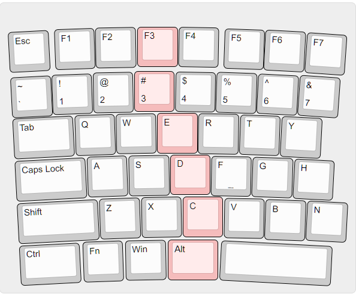
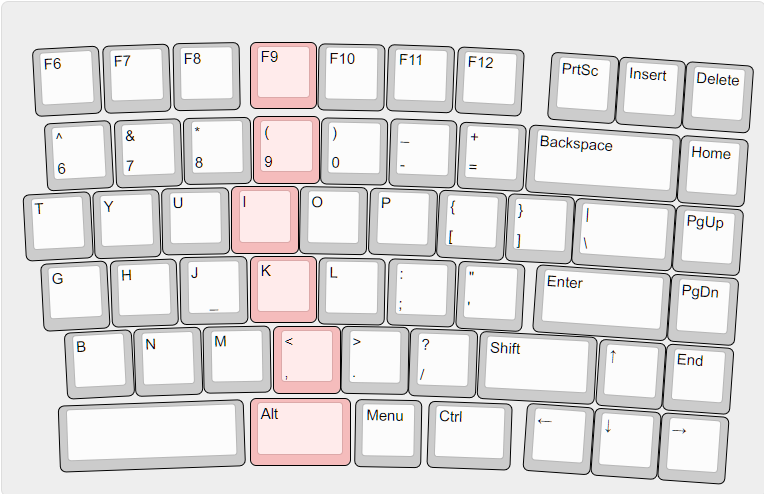
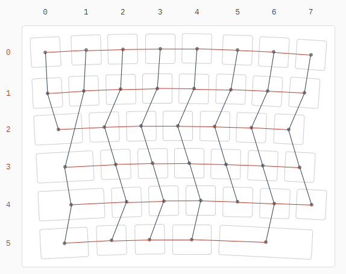
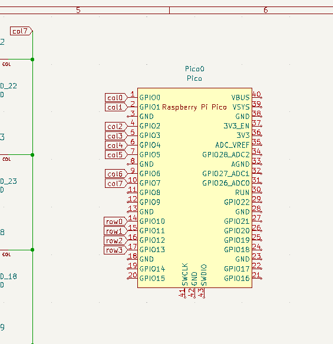
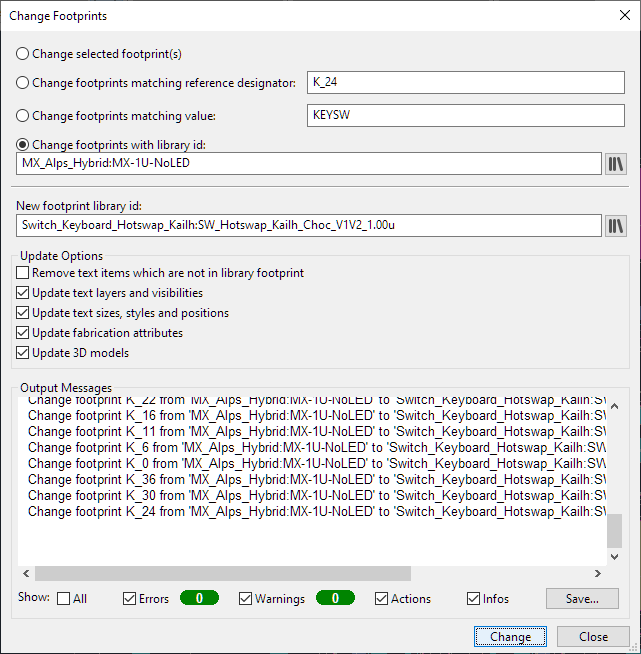
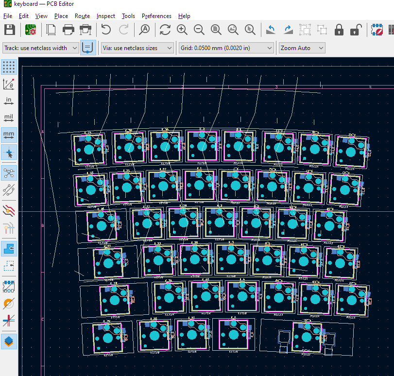

# Building my own ergo keyboard (v1)

## Chapter 1: Why The Layout

Published on [Medium][ch1-medium], [LinkedIn][ch1-lin] and [Habr][ch1-habr].

[ch1-medium]: https://medium.com/@datacompboy/building-my-own-ergo-keyboard-chapter-1-91365cb5df0c?source=friends_link&sk=8509f62b3ab02e2b620bd3738f30f957
[ch1-lin]: https://www.linkedin.com/pulse/building-my-own-ergo-keyboard-ch1-anton-fedorov/
[ch1-habr]: https://habr.com/ru/post/669698/

### Why

Day to day work of anyone working at a computer ends up touching a keyboard. 
Well, a keyboard and a mouse. The taste of what and how you touch evolves over time.

I learned to type myself, ignoring most of the techniques. I ended up typing using all fingers without needing to 
look at keys incorporating some common mistypes into my style -- so that while my left arm presses a wrong key, my
right ring finger already at the backspace. But not all of the mistypes were expected.

And for a long while the best keyboard for me for a long while was [A4Tech KB(S)-8] (or [A4Tech KB(S)-720]) since
once I moved to it the rate of misstypes dramatically dropped without any special learning, it were just right.

I was not that worried about tunnel syndrome nor much about ergonomics other than that. Although then
lockdowns and corona started and I lost access to stash of my backup keyboards (well, I still had two...) and
the keyboards no longer on the market (yeah, i later found they still can be found under a different brand
name). So, the time has come to make changes and to look for an even more ergonomic keyboard, isn't it?

So I looked around and ordered a kind of normal-but-split keyboard. I started with "[Kensington Pro Fit Ergo]"
for being full-sized (including full block of arrows), low-profile keys (i got used to keyboard ones enough
to see benefits of low profile) and negative inclination as recommended.

Adaptation to the split took time -- and I still have not finished! -- mostly because of my typing style.
As I said above, I learned to type myself, and middle columns are shared between arms -- I try to press
"y" with my left arm or "b" with right quite frequently, hitting "t" and "n" respectively. Or pressing the
gap trying to press "7"... I spent a while trying to find a split keyboard with extra keys in the middle --
but there are none on the market that at the same time are normal keyboards (not something like ErgoDox) and
have middle column duplicated. I even contacted several ergo keyboard makers and everyone turned me down.

Okay then -- what else can I do? I looked for the boards and kits -- well, nothing like I want.

What else bothered me? Numpad block. Apparently, nowadays the mouse is something I need for work way too often
and the numpad block of the keyboard constantly gets in the way. Also, I don't really need it. So, my search
for the best shape that I can buy led me to [Microsoft Sculpt] which has numpad separated, the arrows are
embedded into right half in a way like laptops do and home/end/pgup/pgdn are separate keys in a single
column, so no need to use Fn to press them. Perfect! Ordered.

It was a step forward, but still far from being perfect: I really prefer Home/PgUp/PgDn/End instead of
Home/End/PgUp/PgDn. Multimedia keys available thru permanent switch, not Fn key, which makes them useless
(I use Fn keys all the time, so i can't just keep the switch set to alt functions permanently). The large delete
is also questionable, same as insert key position. Plus, over time I found myself moving the keyboard
left/right to find better arms positions and it is never right, i'd prefer a bit wider distance between arms...

So, I would just keep living as is (in the end, the amount of imperfection is lower than it was before), but my
new colleague tried to sell keyboard building class as a fun event to the team, so, I went to look at what
we have right now from the tooling. Once I learned about www.keyboard-layout-editor.com and builder.swillkb.com
I realized that actually it is much much easier to get the keyboard I want than I thought before.

So, it is possible… Then why not? It will be fun!

I'll describe what I do at the details level sufficient for the reader to follow my steps and build your own
keyboard that is made purely for you -- like I do mine for me.

[A4Tech KB(S)-8]: https://www.amazon.de/A4tech-KBS-8-Tastatur-Tasten-schwarz-weiss/dp/B00009VEXN
[A4Tech KB(S)-720]: https://www.a4tech.com/product.aspx?id=80
[Kensington Pro Fit Ergo]: https://www.bhphotovideo.com/c/product/1518961-REG/kensington_k75400us_pro_fit_ergo_wired.html
[Microsoft Sculpt]: https://www.bhphotovideo.com/c/product/1009339-REG/microsoft_5kv_00001_sculpt_ergonomic_keyboard_for.html

### Requirements

So, what I've got so far for the undoubtedly best keyboard (for me):

  * Separate left and right parts
  
    It's hard to make the one distance that is right all the time. Plus during the gaming you don't
	need the right part at all -- but extra space for the mouse would be really good.
  * No numpad

    I don't use it, and if I for some reason would need it one day to type in a lot of digits -- I
	still have N of them from Sculpt keyboards. Or, trivially could make one.
  * Normal-sized arrows integrated into the right half along with the Home/PgUp/PgDn/End column above it.
  
    Learned from years of using laptops -- that layout is compact enough, and the distance between
	arrows and mouse is trivial, allowing me to switch with less effort.
  * Two middle columns available on both sides ("qwerty / tyuiop" layout)
  
    The layout you can't find anywhere... Probably due to a duplication of keys and extra costs.
	But as I wrote in the introduction -- my typing technique utilizes them, and the cost of extra 10
	keys is negligible for the small quantity of keyboards made.
  * Slim keys with short travel
  
    Yeah more precisely -- slim, soft, quiet. I'm not a machinist key typing fan, the clacking
	sound barely hearable thru music in headphones anyway. 
  * Reproducibility
  
    Yeah, I need more than one keyboard to have as a backup in case of schweppes spillage!
	Plus there are a home office and an office office. And backups for them as well.
  * Adjustable position/angles left/right and front/back.
  
	Flat is good, but after typing for a while on Sculpt I see the benefit of having them 
	a bit angled, having middles point higher than borders. And when you type walking on a
	treadmill, negative inclination feels real good.

The list feels incomplete, so it'll indeed grow over time, but that's a start list.

If you want to make your keyboard -- think a bit about what you need from yours. What really matters?
Which bits are itchy and you want to change? Which bits are so comfortable that you don't even notice
them? Write them down. Whenever you make a decision later come and check the list.

### Search for Layout

Since there are no premade or predesigned keyboards with "qwerty/tyuiop" layout, to create one myself was
the whole point.

So, building a basic layout. The [KLE] is quite fun and easy to build simple layouts -- so I just used
104 keys as a base, removed all from the right half, tweaked width until they looked nice, and repeated
for the right half. Rinse and repeat several times.

That's how one of the middle designs looked like: 

I kept thinking around and moving the keys until I got it right by me by adding the Fn key (similar to
Kingston keyboard above) and dropping unnecessary keys around spacebars (I don't remember when I used
scroll lock last time nor pause/break). So I really need them one day -- I placed them onto Fn+Caps
and Fn+PrintScreen.

So the next step is to make the keyboard curved a bit. Why? Because finger lengths are different, it
feels indeed convenient to type on a slightly bent one. Apparently, curving is not a trivial task in
[KLE], I spent a while playing with different base points to use rotation center (i.e. rotate around
key center, rotate around key corner, rotate all around some point below the keyboard, rotate all rows
around their own middle point...) and ended up in a most trivial -- rotate slightly around corner of
the sheet -- to ensure slight bend -- but choose the column that remains horizontal in the middle --
rotate left negative right positive. Then keep in mind that keycaps start from 1u, and that it
is much easier to find "normal" sized ones rather than arbitrary...

I used builder.swillkb.com to generate several cut out designs for several intermediate versions to
print and see how the hand lies on it -- but I was too lazy to try out to cut the holes to see it more
"real".

Everything together combined, I ended up with the following layouts for the [left]:

And this one for the [right]:

I think I will consider adjusting this design later to look nicer (like play more with rotation point
base and positioning, make the border round etc) but I think it's better to iterate over something
physical, rather than keep staring at the screen. Since I don't have anything for quick prototyping at
home nor have access to maker space to try cutting this out etc -- I just decided that it is good
enough for the 1st try.

Now once the layout is settled it is worthwhile to save the links to KLE, save contents from the "Raw
data" tab and download the JSON file from the right-top dropdown "Download JSON" there. They all will
be needed later along the way and it's better to have them saved rather than come back.

[KLE]: https://www.keyboard-layout-editor.com
[left]: http://www.keyboard-layout-editor.com/##@_switchMount=cherry&switchBrand=kailh&pcb:false&plate:true%3B&@_y:0.42&x:3.23&c=%23f5bcbc%3B&=F3%3B&@_y:0.10000000000000009&x:3.15%3B&=%23%0A3%3B&@_y:0.040000000000000036&x:3.72%3B&=E%3B&@_y:0.029999999999999805&x:4.04%3B&=D%3B&@_y:0.040000000000000036&x:4.35&sb=kailh%3B&=C%3B&@_y:0.07000000000000028&x:3.98&w:1.25%3B&=Alt%3B&@_r:1&y:-6.36&x:4.26&c=%23cccccc%3B&=F4%3B&@_y:0.1100000000000001&x:4.2%3B&=$%0A4%3B&@_y:0.029999999999999805&x:4.79%3B&=R%3B&@_y:0.040000000000000036&x:5.12%3B&=F%0A%0A%0A%0A%0A%0A%0A%0A%0A%0A%2F_%3B&@_y:0.040000000000000036&x:5.46%3B&=V%3B&@_r:2&y:-5.3&x:5.4%3B&=F5%3B&@_y:0.0900000000000003&x:5.25%3B&=%25%0A5%3B&@_y:0.029999999999999805&x:5.86%3B&=T%3B&@_y:0.040000000000000036&x:6.21%3B&=G%3B&@_y:0.040000000000000036&x:6.57%3B&=B%3B&@_r:3&y:-5.31&x:6.42%3B&=F6%3B&@_y:0.08999999999999964&x:6.3%3B&=%5E%0A6%3B&@_y:0.029999999999999805&x:6.94%3B&=Y%3B&@_y:0.029999999999999805&x:7.3%3B&=H%3B&@_y:0.020000000000000462&x:7.68%3B&=N%3B&@_y:0.09999999999999964&x:5.6&a:7&w:2.75%3B&=%3B&@_r:4&y:-6.39&x:7.45&a:4%3B&=F7%3B&@_y:0.06999999999999984&x:7.35%3B&=%2F&%0A7%3B&@_r:-3&y:-1.5500000000000003%3B&=Esc%3B&@_y:0.13000000000000012%3B&=~%0A%60%3B&@_y:0.020000000000000462&w:1.5%3B&=Tab%3B&@_y:0.04999999999999982&w:1.75%3B&=Caps%20Lock%3B&@_y:0.04999999999999982&w:2%3B&=Shift%3B&@_y:0.04999999999999982&w:1.5%3B&=Ctrl%3B&@_r:-2&y:-6.33&x:1.15%3B&=F1%3B&@_y:0.12000000000000033&x:1.05%3B&=!%0A1%3B&@_y:0.03000000000000025&x:1.58%3B&=Q%3B&@_y:0.040000000000000036&x:1.85%3B&=A%3B&@_y:0.04999999999999982&x:2.12%3B&=Z%3B&@_y:0.04999999999999982&x:1.67%3B&=Fn%3B&@_r:-1&y:-6.33&x:2.18%3B&=F2%3B&@_y:0.11000000000000054&x:2.1%3B&=%2F@%0A2%3B&@_y:0.03000000000000025&x:2.65%3B&=W%3B&@_y:0.040000000000000036&x:2.95%3B&=S%3B&@_y:0.040000000000000036&x:3.24%3B&=X%3B&@_y:0.05999999999999961&x:2.83%3B&=Win
[left-alt]: https://tinyurl.com/2p8awefu
[right]: http://www.keyboard-layout-editor.com/##@_switchMount=cherry&switchBrand=kailh&pcb:false&plate:true%3B&@_y:0.42&x:3.5&c=%23f5bcbc%3B&=F9%3B&@_y:0.10000000000000009&x:3.55%3B&=(%0A9%3B&@_y:0.040000000000000036&x:3.23%3B&=I%3B&@_y:0.029999999999999805&x:3.5%3B&=K%3B&@_y:0.040000000000000036&x:3.85&sb=kailh%3B&=<%0A,%3B&@_y:0.07000000000000028&x:3.5&w:1.5%3B&=Alt%3B&@_r:1&y:-6.3500000000000005&x:4.53&c=%23cccccc%3B&=F10%3B&@_y:0.10000000000000031&x:4.59%3B&=)%0A0%3B&@_y:0.029999999999999805&x:4.3%3B&=O%3B&@_y:0.040000000000000036&x:4.59%3B&=L%3B&@_y:0.020000000000000462&x:4.95%3B&=>%0A.%3B&@_y:0.08000000000000007&x:5.17%3B&=Menu%3B&@_r:2&y:-6.37&x:5.57%3B&=F11%3B&@_y:0.10000000000000009&x:5.64%3B&=%2F_%0A-%3B&@_y:0.029999999999999805&x:5.38%3B&=P%3B&@_y:0.040000000000000036&x:5.69%3B&=%2F:%0A%2F%3B%3B&@_y:0.03000000000000025&x:6.05%3B&=%3F%0A%2F%2F%3B&@_y:0.05999999999999961&x:6.35&w:1.25%3B&=Ctrl%3B&@_r:3&y:-6.38&x:6.6%3B&=F12%3B&@_y:0.1100000000000001&x:6.69%3B&=+%0A%2F=%3B&@_y:0.029999999999999805&x:6.45%3B&=%7B%0A%5B&_x:0.009999999999999787%3B&=%7D%0A%5D%3B&@_y:0.040000000000000036&x:6.78%3B&="%0A'%3B&@_y:0.019999999999999574&x:7.15&w:1.75%3B&=Shift%3B&@_r:4&y:-5.33&x:8%3B&=PrtSc&=Insert&=Delete%3B&@_y:0.10000000000000009&x:7.75&w:2.25%3B&=Backspace&=Home%3B&@_y:0.029999999999999805&x:8.5&w:1.5%3B&=%7C%0A%5C&=PgUp%3B&@_y:0.03000000000000025&x:8&w:2%3B&=Enter&=PgDn%3B&@_y:0.03000000000000025&x:9%3B&=↑&=End%3B&@_y:0.02999999999999936&x:8%3B&=←&=↓&=→%3B&@_r:-3&y:-5.68&x:0.25%3B&=F6%3B&@_y:0.10999999999999988&x:0.37%3B&=%5E%0A6%3B&@_y:0.03000000000000025%3B&=T%3B&@_y:0.040000000000000036&x:0.2%3B&=G%3B&@_y:0.02999999999999936&x:0.51%3B&=B%3B&@_r:-2&y:-5.23&x:1.3%3B&=F7%3B&@_y:0.11000000000000032&x:1.43%3B&=%2F&%0A7%3B&@_y:0.040000000000000036&x:1.08%3B&=Y%3B&@_y:0.03000000000000025&x:1.3%3B&=H%3B&@_y:0.03000000000000025&x:1.62%3B&=N%3B&@_y:0.08999999999999986&x:0.46&a:7&w:2.75%3B&=%3B&@_r:-1&y:-6.34&x:2.35&a:4%3B&=F8%3B&@_y:0.09999999999999964&x:2.49%3B&=*%0A8%3B&@_y:0.040000000000000036&x:2.15%3B&=U%3B&@_y:0.029999999999999805&x:2.4%3B&=J%0A%0A%0A%0A%0A%0A%0A%0A%0A%0A%2F_%3B&@_y:0.02999999999999936&x:2.73%3B&=M
[right-alt]: https://tinyurl.com/3chhv2ky

<!-- --------- Chapter 1 cut 

### To be continued!

In the next chapter I'll go through a variety of the hardware elements available, trade-offs available
around switches and keyboard making techniques available.

In Chapter 3 the keyboard will be built and software installed.

Chapter 4 is intended for keyboard packaging into the case.

And chapter 5 is about keycaps design and manufacture.

--------- Chapter 2 begin -->

## Chapter 2: Hardware choices

Published on [Medium][ch2-medium], [LinkedIn][ch2-lin] and [Habr][ch2-habr].

[ch2-medium]: https://medium.com/@datacompboy/building-my-own-ergo-keyboard-ch-2-hardware-tradeoffs-271bec3cee2b?source=friends_link&sk=13e6792acb93e835919551b867b044a6
[ch2-lin]: https://www.linkedin.com/pulse/building-my-own-ergo-keyboard-chapter-2-hardware-choices-fedorov/
[ch2-habr]: https://habr.com/ru/post/670458/

### Hunt for key switches

So I want to get a low-profile keyboard. How low is low enough? What kind of switch feeling do I want? These
questions are the hardest ones. Googling gave me several options:
  
  * [Cherry MX Low Profile](https://www.cherrymx.de/en/cherry-mx/mx-low-profile/mx-low-profile-red.html#techSpecs)
    with 3.2mm travel and 11.9mm height 
  * [Cherry MX Ultra Low Profile](https://www.cherrymx.de/blog/cherry-mx-ultra-low-profile.html) with 1.8mm travel
    and only 3.5mm height -- sounds awesome, but you can't buy them (yet).
  * [Kailh Choc v2](http://www.kailh.com/en/Products/Ks/CS/319.html) switches with 3.0mm travel and 11mm height (8mm from pcb)
  * [Kailh X switches](http://www.kailhdz.com/news/kailh-releases-x-switch-pg1425-13461982.html) with 2.5mm total
	travel and 6.5mm height of the switch (6mm from pcb)

So if I want slim keyboard with short travel... I clearly want either Kailh X or Cherry Ultra Low Profile.
With no way to get the latter, it seems that Kailh X is the option, but they are too new on the market -- with no
test boards available, no stabilizers, no keycaps (beyond trivial 1u)... So this is an option that will require
more effort to make it work and to design things that will work for me. I postponed these switches for building
the next generation.

For the MX Low Profile vs Choc switches it looks like the latter is lower and has lower full travel -- so I chose
them for now. So I ordered a [Kailh Choc Switch Tester](https://keycapsss.com/switchestester/switch-tester/174/kailh-choc-switch-tester-12-switches-low-profile?c=10).
Once it arrived, I clicked them all -- and they looked like the brown one feels good enough, not loud and not too 
long to press. With the provided white MBK keycap it looks like "slim enough" to move forward with the design.

Then I ordered the calipers and measured my [Microsoft Sculpt], it seems that travel is about 2.5mm on the
keyboard. So it should not be that much off using 3mm travel switches. Or, it should be possible due to the
actuation point at 1.5mm to try to limit the travel height by making keycaps hitting the keyboard surface at
the similar 2.5mm travel. And if it feels wrong... Well, then I definitely take the longer road for the next
version of keyboard design with Kailh X switches. Maybe by then there would be some available stabilizers and
keycaps to choose from?

There are multiple places where one can buy switches -- after comparison of availability time and cost I went
with https://chosfox.com/ to get the [Kailh Choc Switch Brown / 110](https://chosfox.com/products/choc-switch?variant=41139372261570)
and [Low-profile keycaps set](https://chosfox.com/products/chosfox-kailh-choc-low-profile-keycaps-104keys). The
set is not all the keys I want nor all of the correct sizes -- but it indeed has enough different keys to place
them to try.

### Keyboard schematics decisions

By this point I already chose layout and switches, so time to make the next round of decisions which MCU to use
and do hand wiring or place them on PCB.

#### MCU

For MCU, the main restriction is the number of lines required: my keyboard uses 6 rows, the left half has 8 keys
in the longest row with 42 total keys; the right half has 10 keys in the longest row with 54 total keys. That
means just to be able to wire keys to the MCU I need 6+8=14 GPIO lines for the left half and 16 GPIO lines for
the right half. Plus two lines to connect left and right halves between using serial (or 1 line for I2C). I could
also be creative, and wire keys to into 7*8=15 lines, with I2C fitting into 16 total GPIO lines. So the MCU I am
looking for should start from 16 usable GPIOs, better 18 and it'd be nice to have some slack in case one day I'd
like to add status LEDs for capslock.

What was on the market at the time I made a choice?

  * Pro Micro -- 18 pins + 2 pins if you remove onboard LEDs, starting from ~9 CHF on aliexpress with delivery.
  * Elite-C -- 24 GPIOs, ~15$ + delivery + out of stock it seems
  * Puchi-C -- 24 GPIOs, 19 Euro + delivery
  * Pi Pico RP2040 -- 26 GPIO, 5 euro + delivery
  * Bluepill -- 33 GPIOs, ~$7 with delivery

Well, GPIOs clearly are not a constraint, thx for split design, but cost wise... Looks like Bluepill is the cheapest,
but when I started to build there was a shortage of them -- they were hard to find in stock. They also need a
programmer. Given the cost difference is negligible compared to the cost of switches, for me RPi Pico was definitely
a winner. So, I ordered three of them from a [local store](https://www.pi-shop.ch/raspberry-pi-pico) at 4.75 each
+ 6.40 delivery (~7 CHF each). Three of them for N+1 (yeah, i'm not very good at soldering).

What else should be considered? The RP2040 is available as Pico with Microusb or with Type-C usb, the Pico has a
board that can be directly soldered onto a PCB while Type-C variant is similar to Bluepill / Pro Micro with DIN pins.

And of course, it is worth looking for prices and options before every order! Right now it seems the shortage of IC
is over -- bluepill is available from $4. There are also RP2040-Zero at just $25 for 5 pcs with delivery -- sounds
like even better than Pico since it have really small footprint (18mm * 23.50mm), 20 GPIOs on sides + 9 GPIOs as
solder points. Perhaps I'll build the next version of the keyboard on RP2040-Zero.

#### Building method

To build a keyboard one needs to connect switches in a matrix, and connect rows and columns to the MCU. You could
do it by hand wiring them or make a PCB. The decision is not that trivial, since pros and cons may not always be
expressed in a measurable way.

Hand wiring will require to get a fixed base to fit the switches in, for example ordering a laser cutting for the
frame where keys need to be fit into (the builder.swillkb.com generates you one) and then you'll need to solder
wires and diodes to each of the keys following the connection mesh. If you make a mistake, re-soldering will
require some techniques to do so. If one of the switches will die (or will be found dead on arrival), replacement
will require re-soldering again. If you would like to make another board, you'll need to solder another set in a
very similar way. On the positive side, hand wiring is the only available way to build a mesh if you want a non-flat
keyboard, since you can 3D-print a case ([curved ergodox](https://3dprint.com/29597/3d-printed-ergodox-keyboard/) or
[dactyl manuform](https://github.com/abstracthat/dactyl-manuform)).

On the other side, the PCB will be the fixed base itself, so the case then could be simplified. The PCB will
provide you reproducibility of the matrix, it's harder to make a mistake. Desoldering if you do something wrong
is a bit harder than desoldering air wire. The biggest mistake you can make with a PCB is: soldering a diode in
the wrong polarity or forgetting to solder something (it's almost 500 soldering points to make, so 1% mistake =
5 points to fix :)).

If you decide to go with PCB, you'll either need to do a lot of drilling yourself (5 holes per switch) with
different drill diameters, draw the lines or use LUT technique and play with chemicals to wash it out. Or just
order PCB manufacturing, the drawback here: all the most popular PCB ordering services (NextPCB, JLC PCB,
PCBWay) produce only starting from 5 copies.

One more decision here: you could also solder the switch directly into the mesh or use hotswap sockets, allowing
you to replace switches without desoldering them. You could use hotswap sockets regardless of your decision to
handwire or PCB. Note: if you use hotswap sockets on the PCB, the solidity of switches sitting on the board is
lower than if you solder them in, using wide keys without stabilizers would be difficult.

After some thinking I decided to go with PCB, using hotswap sockets for switches -- so I'll be able to replace
switches if I would like later without need to rewire everything, and to make sure i can stop and continue the
assembly process at any time without need to carefully inspect current state to resume.

#### Ordering elements

At this point, switches are chosen and a decision to use hotswap sockets was made. There are a couple of compatible
variants available, I sent with simple [hotswap slots](https://www.aliexpress.com/item/1005003575767699.html) --
not the best variant but I need something for a prototype, they seem good enough.

There are also needed stabilizers for 2u and larger keys (for self-made keycaps I actually made them from 1.75u).
I ordered [Stabilizers large set (7x2U + 1x6.25U)](https://www.aliexpress.com/item/33039182740.html) -- ofc the
6.25U stabilizer is not needed from the set. Note: this is NOT the stabilizer for the PCB mounting, as I learned
down the road, so the next version of the keyboard will use different stabilizers.

Because I don't want to buy dozens of connectors I don't need and meters of the cables to keep them in a basement
forever, I ordered the [JST SH 1.00 connectors + wire set](https://www.aliexpress.com/item/4000421807858.html).
This is pre-cramped cable + connectors, cheap, trivial, easy.

And, of course, [SMD diodes 100x](https://www.aliexpress.com/item/32849879904.html). It's one of the choices to
be made: use SMD diodes or usual small diodes. Usual diodes are easier to solder on, but they'll need holes on the
PCB for them; SMD diodes don't need holes but smaller and it will be easier to solder them under magnifying glass
(nit: you could order PCB to have them soldered on!)

I also have plenty of USB cables (both MicroUSB and Type-C) to not worry about ordering a cable to connect the
keyboard built, but buying some [foldable](https://de.aliexpress.com/item/4000505888821.html) cable maybe a good
choice.

### Keyboard matrix design

Now, time to convert the layout into a connection matrix, and prepare a PCB base. There are multiple generators
of a PCB from keyboard-layout-editor:

  * https://github.com/jeroen94704/klepcbgen -- doesn't support rotated keys
  * https://github.com/adamws/kicad-kbplacer -- requires first to prepare base
  * http://keyboard-tools.xyz/ -- generates base design and places switches
  * https://kb.xyz.is/ -- shows proposed column/row split before generating the design.

Since I curved the design, the generator from keyboard-tools.xyz generated a suboptimal (in my opinion) connection
matrix, so I have to go with the kb.xyz.is option.

It's working trivial: copy from keyboard-layout-editor content of "raw data", paste into an input text area,
it gives the matrix: .

Click on the left capslock, change column to "1", same for shift and ctrl and we get to the matrix which looks
better to me: 

Save the image of the matrix, it’ll be helpful for handwiring to reproduce design later: print the image and
write over it pins you use to connect to the MCU. Click “Compile”. To build PCB later download the generated
zip file.

Regardless of hand wiring or PCB decision — save the #define for the layout generated, it’ll be needed later
for software generation and repeat the process for the right half. Now, time to make the PCB nice.

### Keyboard PCB design

I'll describe steps to be done in abundant detail for the reader (including future myself) to be able to do
without prior experience with the software.

Download the latest [KiCAD](https://www.kicad.org/) (6.0 in my case) and open `keyboard.pro` from the generated
archive. Now we should install required extra extensions and libraries:
  1. Go to `Tools --> Plugin and Content Manager`, from the "Plugins" tab use search to find and mark "PCBWay
	 Plug-in for KiCad" and from tab "Libraries" install "Keyswitch Kicad Library". Press "Apply changes" and
	 KiCAD will download the plugins.
  2. We will also need the kicad-kbplacer plugin, but it wasn't compatible with KiCAD 6.0 so I did few a tweaks and
     fixes for it. Download [kicad-kbplacer.zip](https://github.com/datacompboy/kicad-kbplacer/blob/master/release/kicad-kbplacer.zip),
	 go again into Plugin and content manager and install it using the "Install from file" button.
  3. Follow instructions from [KiCad-RP-Pico](https://github.com/ncarandini/KiCad-RP-Pico) to get a RPi Pico
     element. Note for the future me: looks like for the RP2040 Zero nice library is
	 [here](https://github.com/crides/kleeb).
  4. It may also be needed to install additional libraries for the stabilizers. As of today, I don't know which
     one to use! I tried plate-mounted PG1350 stabilizer from
	 [Keebio parts](https://github.com/keebio/Keebio-Parts.pretty) but it has problems I'll describe in the
	 keycaps chapter later (tl;dr: it doesn't work for PCB placement since height of the stabilizer is not enough,
	 so I printed the adapters...).

Now we have everything ready. First, double-click on the `keyboard.sch` in the project files list so we can add
a MCU. Initially, the schematics looked like this: 

Now press `A` (`Place --> Add symbol`), filter list by "Pico" and add it. Move it by pressing "M" and
moving by mouse some place right from the matrix, confirm by Enter and stop adding elements by Esc.
Double-click it, edit "Reference" from "U?" to "Pico0".

Now it's time to connect the matrix to the MCU -- I'm lazy, so I just copy-paste the net markers (col0 / row0...)
and directly place them onto the legs of the MCU. So, click on marker, ctrl+c, ctrl+v, rotate if needed with `r`,
place it connected to GPIO leg, enter. Repeat. The result: 

Ah! We also need a connection to the right half. Add one more element -- "Conn_01x04". Double click it, make a
reference to "Link0". Now, connect it to the VSYS. GND, and any UART port. Look for [RPi Pico
pinout](https://www.electrorules.com/raspberry-pi-pico-pinout-specification-and-features/) to find an UART
port to connect to. Now the initial schematic is done: .

Save and press "Open PCB in board editor" (or close schematic editor and double click on pcb file in project
files). As you can see, the switches on the generated board are not rotated, and the switches are not of the
version we want. Select and delete the frame around the switches (note: there are also dots in the corners,
don't forget to remove them too).

Now, select one of the switches (clicking somewhere near its name ("K_24") so the whole switch is highlighted.
`Edit --> Change Footprints`. Select radio at "Change footprints with library id" and click on the library
symbol right to "New footprint library id". In the 1st search field enter "Switch", highlight the line with
"Hotswap_Kailh". From the second list select the footprint of the right unit size. I.e. correct replacement
for `MX_Alps_Hybrid:MX-1U-NoLED` will be `Switch_Keyboard_Hotswap_Kailh:SW_Hotswap_Kailh_Choc_V1V2_1.00u`,
and press "Change": . 

Now the PCB has right footprints: . Repeat to replace all switch types.

Now you need to add a stabilizer for keys that should have ones (i.e. 1.75u or wider -- but I doubt 2u
stabilizers will work well for something more than 3u keys). To do so: again, `Place --> Add Footprint`,
choose the "Stab-PG1350-2u", place it that way so the middle circle aligns with the center of the middle
hole of the key. Double-click on the newly added stab, and make reference to "ST_XX" where XX is the number
of the key -- i.e. make it ST_21 for K_21 key. Rinse and repeat for all keys that need stabilizers.
(Extra catch with these stabilizers: they have two possible placement: one is when the middle point is 
ligned with the  keyswitch middle point, that means its lowest point lower than the lowest point of the
switch and in this case keycaps should be ones that have stabilizer stem centered vertically; the
alternative placement is when the lowest point of the stabilizer is aligned with the lowest point of the
switch, in this case keycaps need to have stab stems a little bit shifted up -- the earlier mentioned
premade keycaps is for the second variant).

Now we ready to fix the placement and rotation of the keys on PCB. To do so, we'll need to convert the
json file downloaded for key layout into an internal format that the KeyAutoPlace plugin can work with.
Go to http://keyboard-tools.xyz/, click on "KLE converter", upload the JSON from KLE and download the
converted file. Now, in the PCB editor go to `Tools --> External Plugins --> KeyAutoPlace`. Choose the
converted Json file into the 1st field, set "key annotation format string" to "K_{}", stabilizer
annotation format string to "ST_{}" and diode annotation format string to "D_{}". Remove the "add tracks"
tick and set the "0-based numeration". Click OK => tadaa! (ignore the misplaced lines, they are not there :)

 

OK, now we need to add two more elements -- the "Pico0" footprint and the "Link0" connector. Use again
`Place --> Add footprint` to find a "RPi-Pico_SMD_TH", place it, double-click to set it's reference to
"Pico0". Add any 4pin connector you would like to use. As I said before, I decided to go with JST connector:
"JST_SH_SM04B-SRSS-TB_1x04-1MP_P1.00mm_Horizontal". Double-click on it and make its reference to be "Link0".
Now, time to update schematic and PCB netlists.

Press F8 (or `Tools --> Update PCB from Schematic`) click "Update PCB", keep only the "Re-link" checkbox
and remove "Delete" and "Replace" checkboxes. There should be no errors (but some warnings). Press "Update PCB".
That'll update netlist and connections matching what was done on the schematic. Now time to update schematic
back so the elements footprints are matching each other. Press `Tools --> Update schematic from PCB`.
There would be errors for missing symbols for stabilizers -- I ignored them. Click "Update Schematic".

Since I need a matrix of connections, the most trivial way is to draw columns and rows at different
sides of the PCB. To do so we need holes but since I chose to use quick-swap switches, their elements
are placed on one side only. Okay, zoom to one of the buttons, click on the connector of the quick
switch (the one that has label "1" and "col0" on it) and change the pad type from "SMD" to "Through-hole"
and set the "Hole size X" to be something reasonable -- I chose 1.2mm. Click OK and the pad gets updated
to be the pad with through-hole. One done, 41 more to go :) select (shift+click) one by one 1st pads of each
switch then open the right-click menu and select `Paste Default Pad Properties to Selected`.

Okay, let's trace the matrix -- go to `File --> Board setup`, go to Net Classes and make default netclass
to be 1mm (or keep it default 0.25mm if you like it thin -- it doesn't matter for the keyboard, really).
I also add into predefined sizes 0.75mm and 0.5mm. Click "ok" and go to the draw!

Choose the layer. Since the diodes are on the back side, the `B.Cu` will be used for the rows and diode
connections, and `F.Cu` for the columns (where through-hole pads were done). So choose `F.Cu` - then
click on the line begin, press "X" (`Route --> Route Single Track`), track to the next point, press click
to finish line or "X" to connect and move on. Once all columns are done, switch the layer to `B.Cu`
(btw: once the diode or row pad is chosen and "X" pressed, the `B.Cu` layer would be automatically chosen).
I connect all the diodes first, then trace the rows. That's how it looks once the matrix is done:

Next step is to decide on the board size -- the Pico makes sense to place on the board border, so the USB
connector is easily available. So draw the rectangle on the `Edge.Cuts` layer and move the MCU and the connector
to the border. To connect the lines to the MCU we don't need to go strictly with whatever connections was
done earlier -- just draw the line from the nearest point to the nearest pin -- and if it not the one that
was on the schematic, then switch to schematic, move the connection to the better pin, save, switch back and
update from schematic (via F8) again. I also added "Mounting holes" of 2.2mm in the corners. Looking back
I think my matrix connection was suboptimal -- I could've just gone with tracing the columns
from the middle on the back line... So my left and right PCBs look different but the distance from the
top switch to the border is the same -- around 6mm -- so I can make the frame similar. So the final
PCB view: 

Go to `Inspect --> Design Rules Checker` to see the errors on the design. Errors I've got:
  - Duplicated drill holes in switch design. While they were probably safe to ignore, I went thru all of
	them: click on the element (switch), Ctrl+E, click on the hole that is duplicated --> drop-down shown
	to choose --> select one --> press "Del" --> Save.
  - Duplicated drill holes from the stabilizer. Same -- select stabilizer, Ctrl+E, delete middle hole.
  - Some complaints about not connected lines or lines with zero width etc -- just remove these segments
	or draw missing parts etc. Just fix them.

Once DRC gets zero errors/warnings design is done!

Extra bit to keep in mind: the left and the right halves should have TX/RX/+5/GND swapped so 1-to-1 cable
will connect them correctly: the VSYS on one the left board goes to the VSYS on the right, the GND to the
GND and the TX on one half should be connected with the RX of another and vice versa.

Here is the [project](https://github.com/datacompboy/split-keyboard/tree/main/pcb) with both halves I've
done and [archives](https://github.com/datacompboy/split-keyboard/tree/main/pcb-bin) I used to order.

Once design for both halves looks final, time to order fabrication -- I used PCBWay plugin installed earlier
that produces ZIP file with everything required to order and upload it to PCBWay at the same time -- the
generated ZIP file available to download back from there, so I saved it for my future reference and used
to upload to all three services: PCBWay, JLCPCB and NextPCB to compare lead time, manufacturing time and
cost.

JLCPCB won, so both halves were sent to production here.

<!-- --------- Chapter 2 cut

## To be continued!

The [previous chapter] explained why I decided to do this and the layout I'm building on.

In the next the hardware and the software for the keyboard will be built and everything put together.

The next after, Chapter 4, is intended for keyboard packaging into the case.

And the last in the sequence 5th chapter is about keycaps design and manufacture.

--------- Chapter 3 start -->
